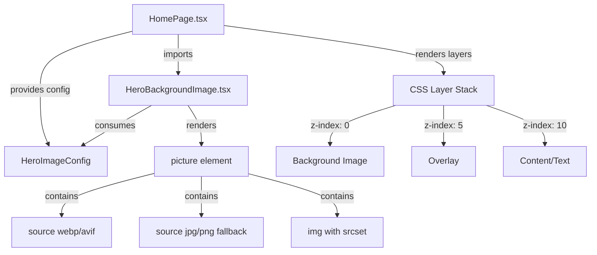

# Design Document: Hero Background Banner

## Overview

This design implements background image/banner support for the hero section of HomePage.tsx. The solution maintains text readability across all devices while providing optimal image performance through responsive image techniques, modern format support (WebP/AVIF), and native lazy loading.

### Key Design Decisions

**1. Use HTML `<picture>` element with `<source>` for format fallback**
- Modern formats (WebP, AVIF) provide 30-50% size reduction compared to JPEG
- `<picture>` enables browser-native format selection based on capabilities
- No JavaScript required for format fallback logic

**2. Use `srcset` with viewport widths instead of pixel density descriptors**
- Addresses different screen sizes (mobile, tablet, desktop) rather than retina displays
- Simpler generation strategy: one image per breakpoint rather than multiple densities
- Aligns with existing Tailwind breakpoint system (768px, 1024px)

**3. Use native `loading="lazy"` attribute instead of IntersectionObserver**
- Hero images are above-the-fold, so lazy loading provides graceful degradation for slow connections
- Native attribute has 96% browser support and requires zero JavaScript
- Simpler implementation than IntersectionObserver-based solutions
- Reference: [MDN Browser Compatibility for loading attribute](https://developer.mozilla.org/en-US/docs/Web/HTML/Element/img#browser_compatibility)

**4. Use absolute positioning with z-index layers instead of background-image CSS**
- Background-image CSS doesn't support `<picture>` element or srcset
- Absolute positioning enables proper semantic HTML with alt text for accessibility
- Provides fine-grained control over stacking context: image → overlay → content
- Reference: [CSS Stacking Context](https://developer.mozilla.org/en-US/docs/Web/CSS/Guides/Positioned_layout/Stacking_context)

**5. Maintain existing gradient as fallback instead of solid color**
- Preserves visual consistency when no image is configured
- No visual "jump" if image fails to load or during configuration
- Existing design already proven with gradient background

### Architecture Diagram



## Architecture

### Component Structure

The feature adds a new `HeroBackgroundImage` component that integrates into the existing HomePage hero section structure:

**Existing Structure (HomePage.tsx lines 9-67):**
```
<section> (hero container)
  └── <div> (gradient background - absolute positioned)
  └── <div> (decorative blur circles - absolute positioned)
  └── <div> (content container - relative z-10)
      └── Badge, Heading, CTA buttons, Stats
```

**New Structure:**
```
<section> (hero container)
  └── <HeroBackgroundImage> (NEW - absolute positioned, z-0)
       └── <picture>
            └── <source> (WebP/AVIF)
            └── <source> (fallback formats)
            └──  (with srcset)
  └── <div> (overlay layer - absolute positioned, z-5)
  └── <div> (gradient fallback - conditional render, z-0)
  └── <div> (decorative blur circles - z-1, dimmed opacity)
  └── <div> (content container - relative z-10)
```

### Integration Strategy

**Minimal Changes to HomePage.tsx:**
1. Import `HeroBackgroundImage` and `HeroImageConfig` type
2. Define configuration object above component
3. Conditionally render either `HeroBackgroundImage` OR existing gradient divs
4. Add overlay div when image is present
5. Reduce opacity of decorative blur circles when image is present (from 0.2 to 0.1)

**No Changes Required:**
- Existing text content structure remains unchanged
- CTA buttons, badge, stats - no modifications
- Responsive padding and spacing - untouched
- Color scheme and design tokens - preserved

## Components and Interfaces

### HeroBackgroundImage Component

**Purpose:** Render responsive background image with modern format support and fallback mechanism.

**Location:** `frontend/src/components/HeroBackgroundImage.tsx`

**Component Signature:**
```typescript
interface HeroBackgroundImageProps {
  config: HeroImageConfig;
  className?: string;
}

export const HeroBackgroundImage: React.FC<HeroBackgroundImageProps> = ({ 
  config, 
  className = '' 
}) => {
  // Renders <picture> element with sources and srcset
}
```

**Rendering Logic:**
1. Return `null` if no image URLs provided in config
2. Render `<picture>` element with absolute positioning
3. Add `<source>` elements for modern formats (WebP, AVIF) if provided
4. Add `<source>` elements for fallback formats (JPG, PNG)
5. Render `` with srcset containing all viewport sizes
6. Apply object-fit: cover, object-position from config
7. Include alt text and loading="lazy" attributes

**Example JSX Output:**
```tsx
<picture className="absolute inset-0 w-full h-full z-0">
  {/* Modern format sources */}
  <source 
    type="image/webp"
    srcSet="desktop.webp 1920w, tablet.webp 1024w, mobile.webp 768w"
    sizes="100vw"
  />
  
  {/* Fallback format sources */}
  <source 
    type="image/jpeg"
    srcSet="desktop.jpg 1920w, tablet.jpg 1024w, mobile.jpg 768w"
    sizes="100vw"
  />
  
  {/* Final fallback img */}
  
</picture>
```

### HeroOverlay Component

**Purpose:** Render semi-transparent overlay to ensure text readability over any image.

**Location:** `frontend/src/components/HeroOverlay.tsx`

**Component Signature:**
```typescript
interface HeroOverlayProps {
  opacity?: number; // 0.4 to 0.6
  color?: string;   // CSS color value
  className?: string;
}

export const HeroOverlay: React.FC<HeroOverlayProps> = ({ 
  opacity = 0.5, 
  color = 'rgb(15, 23, 42)', // slate-900
  className = '' 
}) => {
  return (
    <div 
      className={`absolute inset-0 z-5 pointer-events-none ${className}`}
      style={{ 
        backgroundColor: color,
        opacity: opacity 
      }}
      aria-hidden="true"
    />
  );
}
```

**Design Rationale:**
- Separate component for reusability
- Inline styles for opacity to avoid creating dozens of utility classes
- `pointer-events-none` ensures overlay doesn't block clicks
- `aria-hidden` since it's purely visual decoration
- Default values match requirements (slate-900, 50% opacity)

### HomePage Integration

**Modified Section (lines 9-67):**
```typescript
// Configuration (defined above component)
const heroImageConfig: HeroImageConfig | null = {
  desktop: {
    webp: '/images/hero/desktop.webp',
    jpg: '/images/hero/desktop.jpg',
  },
  tablet: {
    webp: '/images/hero/tablet.webp',
    jpg: '/images/hero/tablet.jpg',
  },
  mobile: {
    webp: '/images/hero/mobile.webp',
    jpg: '/images/hero/mobile.jpg',
  },
  alt: 'Professional printing facility with modern equipment',
  objectPosition: 'center center',
  overlayOpacity: 0.5,
};

// Inside component JSX:
<section className="relative w-full bg-slate-950 py-32 lg:py-48 overflow-hidden">
  {/* Background Image or Gradient Fallback */}
  {heroImageConfig ? (
    <>
      <HeroBackgroundImage config={heroImageConfig} />
      <HeroOverlay opacity={heroImageConfig.overlayOpacity} />
    </>
  ) : (
    <>
      {/* Original gradient backgrounds */}
      <div className="absolute inset-0 bg-gradient-to-br from-indigo-900/50 via-slate-900 to-purple-900/40 z-0"></div>
    </>
  )}
  
  {/* Decorative blurred circles - reduced opacity when image present */}
  <div 
    className={`absolute top-0 right-0 w-[800px] h-[800px] bg-indigo-500 rounded-full blur-[120px] -translate-y-1/2 translate-x-1/3 pointer-events-none z-1 ${heroImageConfig ? 'opacity-10' : 'opacity-20'}`}
  ></div>
  <div 
    className={`absolute bottom-0 left-0 w-[600px] h-[600px] bg-purple-500 rounded-full blur-[100px] translate-y-1/3 -translate-x-1/4 pointer-events-none z-1 ${heroImageConfig ? 'opacity-10' : 'opacity-20'}`}
  ></div>

  {/* Content remains unchanged */}
  <div className="relative z-10 max-w-7xl mx-auto px-4 sm:px-6 lg:px-8 text-center flex flex-col items-center">
    {/* ... existing content ... */}
  </div>
</section>
```

## Data Models

### HeroImageConfig Type

**Location:** `frontend/src/types/heroImage.ts`

```typescript
/**
 * Configuration for a single image source with multiple formats
 */
export interface ImageSource {
  /** WebP format URL (modern, recommended) */
  webp?: string;
  
  /** AVIF format URL (modern, best compression) */
  avif?: string;
  
  /** JPEG format URL (fallback) */
  jpg?: string;
  
  /** PNG format URL (fallback, for images requiring transparency) */
  png?: string;
}

/**
 * Complete configuration for hero background image
 * All viewport-specific images are optional - system will fall back to next larger size
 */
export interface HeroImageConfig {
  /** Desktop image (1920x1080 or 1920x800 recommended) */
  desktop?: ImageSource;
  
  /** Tablet image (1024x768 recommended) */
  tablet?: ImageSource;
  
  /** Mobile image (768x1024 portrait or 768x512 landscape recommended) */
  mobile?: ImageSource;
  
  /** Alt text for accessibility (empty string if decorative) */
  alt: string;
  
  /** CSS object-position value (default: 'center center') */
  objectPosition?: string;
  
  /** Overlay opacity 0-1 (default: 0.5) */
  overlayOpacity?: number;
  
  /** Overlay color as CSS value (default: 'rgb(15, 23, 42)' - slate-900) */
  overlayColor?: string;
  
  /** Fallback src for img element (required, usually desktop JPG) */
  fallbackSrc: string;
}

/**
 * Viewport breakpoints matching Tailwind CSS defaults
 */
export const VIEWPORT_BREAKPOINTS = {
  mobile: 768,   // < 768px
  tablet: 1024,  // 768px - 1023px
  desktop: 1920, // >= 1024px
} as const;

/**
 * Recommended image dimensions for optimal display
 */
export const RECOMMENDED_DIMENSIONS = {
  desktop: {
    wide: { width: 1920, height: 800 },      // 2.4:1 aspect ratio
    standard: { width: 1920, height: 1080 }, // 16:9 aspect ratio
  },
  tablet: {
    standard: { width: 1024, height: 768 },  // 4:3 aspect ratio
  },
  mobile: {
    portrait: { width: 768, height: 1024 },  // 3:4 aspect ratio
    landscape: { width: 768, height: 512 },  // 3:2 aspect ratio
  },
} as const;

/**
 * Maximum file size limits (in bytes)
 */
export const MAX_FILE_SIZES = {
  desktop: 500 * 1024,  // 500 KB
  tablet: 300 * 1024,   // 300 KB
  mobile: 200 * 1024,   // 200 KB
} as const;
```

### Configuration Examples

**Example 1: Full configuration with all formats**
```typescript
const fullConfig: HeroImageConfig = {
  desktop: {
    avif: '/images/hero/desktop.avif',
    webp: '/images/hero/desktop.webp',
    jpg: '/images/hero/desktop.jpg',
  },
  tablet: {
    webp: '/images/hero/tablet.webp',
    jpg: '/images/hero/tablet.jpg',
  },
  mobile: {
    webp: '/images/hero/mobile.webp',
    jpg: '/images/hero/mobile.jpg',
  },
  alt: 'Modern printing facility with industrial equipment',
  objectPosition: 'center 30%', // Focus on upper portion
  overlayOpacity: 0.6, // Darker overlay for better text contrast
  overlayColor: 'rgb(15, 23, 42)',
  fallbackSrc: '/images/hero/desktop.jpg',
};
```

**Example 2: Minimal configuration (desktop only, single format)**
```typescript
const minimalConfig: HeroImageConfig = {
  desktop: {
    jpg: '/images/hero/hero-banner.jpg',
  },
  alt: 'Company banner',
  fallbackSrc: '/images/hero/hero-banner.jpg',
};
```

**Example 3: No image (use gradient fallback)**
```typescript
const noImageConfig: HeroImageConfig | null = null;
```

## Image Optimization Strategy

### Format Priority and Browser Support

The `<picture>` element evaluates `<source>` elements in order and uses the first compatible format:

**Priority Order:**
1. **AVIF** - Best compression (30-50% smaller than JPEG), Chrome 85+, Firefox 93+, Safari 16.1+
2. **WebP** - Excellent compression (25-35% smaller than JPEG), Chrome 23+, Firefox 65+, Safari 14+
3. **JPEG/PNG** - Universal fallback, 100% browser support

**Implementation in HeroBackgroundImage:**
```typescript
<picture>
  {/* Priority 1: AVIF if available */}
  {hasAVIF && (
    <source 
      type="image/avif"
      srcSet={generateAVIFSrcSet(config)}
      sizes="100vw"
    />
  )}
  
  {/* Priority 2: WebP if available */}
  {hasWebP && (
    <source 
      type="image/webp"
      srcSet={generateWebPSrcSet(config)}
      sizes="100vw"
    />
  )}
  
  {/* Priority 3: JPEG/PNG fallback (always present) */}
  
</picture>
```

### Responsive Image Selection

The browser selects the appropriate image based on viewport width using the `sizes` attribute and `srcset`:

**srcSet Format:** `url widthDescriptor`
- Example: `"desktop.webp 1920w, tablet.webp 1024w, mobile.webp 768w"`
- The `w` descriptor tells the browser the intrinsic width of each image

**sizes Attribute:** `"100vw"`
- Tells the browser the image will occupy 100% of viewport width
- Browser combines this with device pixel ratio to select optimal image
- Reference: [MDN Responsive Images Guide](https://developer.mozilla.org/en-US/docs/Web/HTML/Guides/Responsive_images)

**Selection Logic:**
```
Viewport Width <= 767px:
  → Loads mobile image (768w source)

Viewport Width 768px - 1023px:
  → Loads tablet image (1024w source)

Viewport Width >= 1024px:
  → Loads desktop image (1920w source)
```

### Lazy Loading Implementation

**Native Loading Attribute:**
```html

```

**Behavior:**
- Hero images are typically above-the-fold (visible immediately)
- `loading="lazy"` provides graceful degradation on slow connections
- Browser defers image load until shortly before entering viewport
- Zero JavaScript required, 96% browser support
- Fallback: Browsers without support load images immediately (safe)

**Why Not IntersectionObserver:**
- IntersectionObserver is for below-the-fold images (carousels, galleries)
- Hero images should load with priority, not be deferred aggressively
- Native attribute is simpler and more performant
- Reference: [Cloudinary - React Lazy Loading Best Practices](https://cloudinary.com/guides/web-performance/react-lazy-loading-images)

### Image Processing Requirements

**Desktop Images (1920x1080 or 1920x800):**
- Target file size: < 500 KB
- Compression quality: 80-85% for JPEG, 85-90% for WebP/AVIF
- Color space: sRGB
- Resolution: 72 DPI (web standard)

**Tablet Images (1024x768):**
- Target file size: < 300 KB
- Compression quality: 80-85% for JPEG, 85-90% for WebP/AVIF
- Crop strategy: Center focus or art-directed crop

**Mobile Images (768x1024 or 768x512):**
- Target file size: < 200 KB
- Compression quality: 75-80% for JPEG, 80-85% for WebP/AVIF
- Crop strategy: Portrait or landscape based on device orientation

**Recommended Tools:**
- **ImageMagick** - CLI tool for batch processing
- **Squoosh** - Web-based with visual quality comparison
- **sharp** (Node.js) - Programmatic image processing pipeline
- **Optimizilla** - Web-based JPEG/PNG compression

## CSS Architecture

### Z-Index Layer System

The hero section uses a clear z-index stacking system:

```
z-10:  Hero content (text, buttons, badge)
z-5:   Dark overlay for readability
z-1:   Decorative blur circles (reduced opacity with image)
z-0:   Background image OR gradient fallback
```

**Rationale:**
- Content always on top (z-10) regardless of image presence
- Overlay (z-5) sits between content and image
- Decorative elements (z-1) slightly above image, subtle effect
- Image/gradient at base layer (z-0)

**Tailwind Classes:**
```css
.z-10 → z-index: 10
.z-5  → z-index: 5   (custom utility - needs configuration)
.z-1  → z-index: 1   (custom utility - needs configuration)
.z-0  → z-index: 0
```

### Custom Tailwind Configuration

Add custom z-index utilities to `tailwind.config.js`:

```javascript
module.exports = {
  theme: {
    extend: {
      zIndex: {
        '1': '1',
        '5': '5',
      }
    }
  }
}
```

### Positioning and Layout

**Hero Section Container:**
```css
.relative      /* Creates stacking context */
.w-full        /* 100% width */
.overflow-hidden /* Clips overflowing background */
```

**Background Image/Gradient Layer:**
```css
.absolute      /* Positioned relative to hero section */
.inset-0       /* Top:0, Right:0, Bottom:0, Left:0 - fills container */
.z-0           /* Base layer */
```

**Overlay Layer:**
```css
.absolute
.inset-0
.z-5
.pointer-events-none /* Doesn't block clicks on content */
```

**Content Layer:**
```css
.relative      /* Creates new stacking context */
.z-10          /* Above overlay and image */
```

### Object-Fit and Object-Position

```css
object-fit: cover    /* Image fills container, may crop edges */
object-position: center center /* Focal point for cropping */
```

**Alternative Values:**
```css
object-position: center top      /* Keep top edge visible */
object-position: center 30%      /* Focus on upper 30% */
object-position: left center     /* Keep left edge visible */
```

**Why Not `background-image` CSS:**
- Cannot use `<picture>` element for format fallback
- Cannot use `srcset` for responsive images
- No semantic HTML or alt text support
- Reference: [StackOverflow - Responsive Background Images](https://stackoverflow.com/questions/21991019/responsive-background-images)

## Correctness Properties

_No correctness properties are defined for this feature because property-based testing is not applicable._

### Rationale for Not Using PBT

This feature is not suitable for property-based testing (PBT). After analyzing all acceptance criteria, this feature falls into categories explicitly excluded from PBT:

**1. UI Rendering and Layout**
- The feature primarily renders React components that output HTML/CSS structure
- Tests verify that specific elements (Image_Container, Overlay) are rendered with correct CSS classes
- Behavior involves visual positioning, z-index stacking, and layout properties
- These are example-based tests, not universal properties that vary meaningfully with input

**2. Browser-Native Infrastructure Behavior**
- Responsive image selection via `srcset` and `sizes` attributes is handled by browser-native behavior
- Modern format fallback through `<picture>` element is browser-controlled
- Lazy loading via `loading="lazy"` attribute relies on browser implementation
- Testing these requires integration tests with real browsers, not property-based logic tests

**3. Configuration Validation Without Transformation Logic**
- The feature accepts configuration objects (HeroImageConfig) and passes values to HTML attributes
- There's minimal transformation logic - mostly mapping config fields to element attributes
- The one fallback selection function (selectImageSource) has a limited input space (8 combinations) better suited to example-based tests than 100+ PBT iterations

### Appropriate Testing Approaches

Instead of property-based testing, this feature uses:

**Snapshot Tests:**
- Verify component HTML structure remains stable
- Capture picture element with source elements and srcset strings
- Ensure z-index layering and CSS classes are correct

**Example-Based Unit Tests:**
- Test that overlay renders with correct opacity and color
- Verify img element has loading="lazy" and correct alt text
- Confirm fallback gradient displays when config is null
- Test selectImageSource function with all 8 combinations of viewport images

**Integration Tests:**
- Verify responsive image loading at different viewport widths
- Test format fallback in browsers with varying format support
- Confirm lazy loading behavior with network throttling
- Validate image load failure graceful degradation

**Visual Regression Tests:**
- Compare screenshots across viewports (mobile, tablet, desktop)
- Verify overlay opacity and text readability
- Ensure layout stability during image loading

### Testing Coverage Without PBT

All testable acceptance criteria are covered through the approaches above:

- **Requirements 1.1-1.4**: Example-based tests for Image_Container rendering and HTML structure
- **Requirements 2.1-2.5**: Integration tests for responsive image selection and CSS properties
- **Requirements 3.1-3.4**: Example-based tests for Overlay rendering and z-index layering
- **Requirements 4.1-4.5**: Integration tests for lazy loading, format selection; smoke tests for file sizes
- **Requirements 5.1-5.4**: Example-based tests for configuration acceptance and fallback logic
- **Requirements 7.1-7.4**: Example-based tests for alt text, ARIA attributes, and semantic HTML
- **Requirements 8.1-8.4**: Integration tests for loading states and error handling

This approach provides comprehensive test coverage appropriate to the feature's nature as a UI rendering and layout component that relies heavily on browser-native behavior.

## Error Handling

### Image Load Failure

**Scenario:** Network error, 404, or corrupt image file

**Handling:**
1. Browser attempts to load image from srcset
2. If all sources fail, renders alt text briefly
3. Gradient fallback remains visible behind failed image
4. User sees gradient background (existing design)
5. Content remains fully readable and interactive

**Implementation:**
- No JavaScript error handling needed
- Browser native fallback behavior is sufficient
- Gradient div remains in DOM as visual safety net

### Missing Configuration

**Scenario:** `heroImageConfig` is `null` or `undefined`

**Handling:**
```typescript
{heroImageConfig ? (
  <>
    <HeroBackgroundImage config={heroImageConfig} />
    <HeroOverlay opacity={heroImageConfig.overlayOpacity} />
  </>
) : (
  <div className="absolute inset-0 bg-gradient-to-br from-indigo-900/50 via-slate-900 to-purple-900/40 z-0"></div>
)}
```

**Behavior:**
- Conditional render based on config presence
- No config → render original gradient
- Config present → render image + overlay

### Partial Configuration

**Scenario:** Only desktop image provided, no tablet/mobile

**Handling:**
```typescript
const selectImageSource = (
  config: HeroImageConfig,
  viewport: 'mobile' | 'tablet' | 'desktop'
): ImageSource => {
  // Try requested viewport
  if (config[viewport]) {
    return config[viewport]!;
  }
  
  // Fall back to next larger size
  if (viewport === 'mobile' && config.tablet) {
    return config.tablet;
  }
  
  if ((viewport === 'mobile' || viewport === 'tablet') && config.desktop) {
    return config.desktop;
  }
  
  // Final fallback to desktop (required)
  return config.desktop || { jpg: config.fallbackSrc };
};
```

**Behavior:**
- Mobile viewport: Try mobile → tablet → desktop
- Tablet viewport: Try tablet → desktop
- Desktop viewport: Use desktop (required)

### Unsupported Formats

**Scenario:** Browser doesn't support WebP or AVIF

**Handling:**
- Browser skips unsupported `<source type="...">` elements
- Falls through to `` element with JPEG/PNG srcset
- No JavaScript detection needed
- Reference: [MDN Picture Element](https://developer.mozilla.org/en-US/docs/Web/HTML/Element/picture)

## Testing Strategy

### Rationale for Not Using PBT

This feature involves **UI rendering and layout**, which is explicitly excluded from property-based testing according to design best practices. The feature:

- Renders React components that output HTML/CSS (HeroBackgroundImage, HeroOverlay)
- Produces visual layouts with z-index stacking and positioning
- Relies on browser-native behavior for format selection and responsive images
- Requires visual verification rather than algorithmic property validation

**Appropriate Testing Approaches:**
- **Snapshot tests** for component HTML output structure
- **Visual regression tests** for layout and appearance across viewports
- **Example-based unit tests** for helper functions and configuration logic
- **Integration tests** for browser compatibility and image loading behavior

### Unit Tests

**Component: HeroBackgroundImage**
- Renders null when no config provided
- Renders picture element with correct structure
- Generates srcset strings correctly for each format
- Applies object-position from config
- Uses fallbackSrc for img element
- Includes alt text from config
- Adds loading="lazy" attribute

**Component: HeroOverlay**
- Renders with default opacity (0.5)
- Renders with custom opacity from props
- Applies correct background color
- Includes pointer-events-none class
- Includes aria-hidden attribute

**Integration: HomePage Hero Section**
- Renders gradient when config is null
- Renders HeroBackgroundImage when config provided
- Renders HeroOverlay when config provided
- Reduces blur circle opacity when image present
- Maintains z-index layering (content above overlay above image)

**Helper Functions:**
- `generateSrcSet()` - Builds srcset string from ImageSource
- `selectImageSource()` - Selects appropriate image for viewport
- `hasFormat()` - Checks if format is available in config

### Snapshot Tests

**Purpose:** Verify component HTML structure remains stable across changes

**Test Cases:**
1. HeroBackgroundImage with full configuration (all formats, all viewports)
2. HeroBackgroundImage with minimal configuration (desktop only, single format)
3. HeroBackgroundImage with no configuration (renders null)
4. HeroOverlay with default props
5. HeroOverlay with custom opacity and color
6. HomePage hero section with image configuration
7. HomePage hero section without image configuration (gradient fallback)

**Example:**
```typescript
describe('HeroBackgroundImage', () => {
  it('matches snapshot with full configuration', () => {
    const config: HeroImageConfig = {
      desktop: { webp: '/desktop.webp', jpg: '/desktop.jpg' },
      tablet: { webp: '/tablet.webp', jpg: '/tablet.jpg' },
      mobile: { webp: '/mobile.webp', jpg: '/mobile.jpg' },
      alt: 'Test image',
      fallbackSrc: '/desktop.jpg',
    };
    const { container } = render(<HeroBackgroundImage config={config} />);
    expect(container).toMatchSnapshot();
  });
});
```

### Visual Regression Tests

**Scenarios:**
1. Hero section with no image (gradient fallback)
2. Hero section with desktop image only
3. Hero section with full image set (mobile/tablet/desktop)
4. Hero section with custom overlay opacity (0.4, 0.5, 0.6)
5. Hero section with custom object-position (center top, center 30%)

**Viewport Sizes:**
- Mobile: 375px × 667px (iPhone SE)
- Tablet: 768px × 1024px (iPad)
- Desktop: 1920px × 1080px (Full HD)

**Tools:**
- **Percy** - Visual regression platform
- **Chromatic** - Storybook visual testing
- **Playwright** - Screenshot comparison

### Performance Tests

**Metrics:**
- Largest Contentful Paint (LCP) - Target: < 2.5s
- Cumulative Layout Shift (CLS) - Target: < 0.1
- Time to Interactive (TTI) - Target: < 3.5s

**Test Scenarios:**
1. **Fast 3G Connection:**
   - Desktop image loads within 3 seconds
   - Content visible and interactive during load
   - Lazy loading defers image appropriately

2. **Slow 3G Connection:**
   - Gradient fallback visible immediately
   - Image loads progressively
   - No blocking of content rendering

3. **Image Load Failure:**
   - Gradient remains visible
   - Alt text displayed briefly
   - Layout does not shift

**Tools:**
- **Lighthouse** - Performance audit
- **WebPageTest** - Real-world network conditions
- **Chrome DevTools** - Network throttling

### Accessibility Tests

**Automated Tests:**
- Alt text present on img element
- Overlay has aria-hidden attribute
- Heading structure maintained
- Color contrast ratios (text on overlay) >= 4.5:1

**Manual Tests:**
- Screen reader announces alt text appropriately
- Keyboard navigation unaffected by image/overlay
- Focus indicators visible on all interactive elements
- Text remains readable with different overlay opacities

**Tools:**
- **axe DevTools** - Automated accessibility scanning
- **NVDA/JAWS** - Screen reader testing
- **Lighthouse** - Accessibility audit

### Browser Compatibility Tests

**Browsers:**
- Chrome 90+ (WebP, AVIF support)
- Firefox 90+ (WebP, AVIF support)
- Safari 14+ (WebP support)
- Safari 16+ (AVIF support)
- Edge 90+ (WebP, AVIF support)

**Test Cases:**
1. Modern browser with AVIF support → loads AVIF
2. Modern browser with WebP support → loads WebP
3. Legacy browser → loads JPEG/PNG
4. Browser without loading="lazy" support → loads immediately

## Accessibility and SEO

### Semantic HTML

**Image Element:**
```html

```

**Alt Text Guidelines:**
- Descriptive for meaningful images
- Empty (`alt=""`) for purely decorative images
- No "image of" or "photo of" prefix
- Concise: 125 characters or less

### ARIA Attributes

**Overlay:**
```html
<div aria-hidden="true">
  <!-- Overlay is purely visual, hide from assistive tech -->
</div>
```

**Background Image:**
- No ARIA role needed (standard img element)
- Alt text provides semantic information
- Part of hero section landmarks

### Heading Structure

**Preserved Structure:**
```html
<section> <!-- Hero section -->
  <h1>Enterprise Quality Print, Delivered Faster.</h1>
  <!-- Subheading, CTAs, etc. -->
</section>
```

- Background image doesn't interfere with document outline
- Heading hierarchy remains logical (h1 → h2 → h3)
- Screen readers navigate content normally

### SEO Considerations

**Image Indexing:**
- Descriptive alt text helps image search ranking
- Semantic file names (e.g., `printing-facility-hero.jpg`)
- Appropriate image dimensions and file sizes

**Page Performance:**
- LCP improvement with optimized images
- Core Web Vitals contribute to search ranking
- Native lazy loading improves initial page load

**Content Visibility:**
- Text content remains in HTML (not in image)
- Overlay doesn't hide content from crawlers
- Links and CTAs remain crawlable

## Implementation Plan

### Phase 1: Core Components (4 hours)

1. **Create type definitions** (30 min)
   - `frontend/src/types/heroImage.ts`
   - HeroImageConfig interface
   - ImageSource interface
   - Constants (breakpoints, dimensions, file sizes)

2. **Implement HeroBackgroundImage** (2 hours)
   - `frontend/src/components/HeroBackgroundImage.tsx`
   - Picture element with sources
   - srcSet generation logic
   - Helper functions (selectImageSource, generateSrcSet, hasFormat)
   - Unit tests

3. **Implement HeroOverlay** (30 min)
   - `frontend/src/components/HeroOverlay.tsx`
   - Simple overlay div with opacity
   - Unit tests

4. **Add custom Tailwind utilities** (15 min)
   - Update `tailwind.config.js`
   - Add z-1 and z-5 utilities

5. **Component documentation** (45 min)
   - JSDoc comments
   - Usage examples
   - Storybook stories (if applicable)

### Phase 2: HomePage Integration (2 hours)

1. **Modify HomePage.tsx** (1 hour)
   - Import new components
   - Add configuration object
   - Conditional rendering logic
   - Adjust blur circle opacity

2. **Testing** (30 min)
   - Visual verification across viewports
   - Z-index layering validation
   - Fallback behavior testing

3. **Documentation** (30 min)
   - Update component comments
   - Add configuration examples
   - Document overlay customization

### Phase 3: Documentation and Assets (3 hours)

1. **Create sample images** (1 hour)
   - Generate placeholder images in correct dimensions
   - Process to WebP/AVIF formats
   - Verify file sizes under limits

2. **Write developer guide** (1 hour)
   - Configuration reference
   - Image preparation guidelines
   - Troubleshooting section

3. **Write owner guide** (1 hour)
   - Optimal dimensions documentation
   - Image format recommendations
   - File size guidelines
   - Tool recommendations

### Phase 4: Testing and Optimization (3 hours)

1. **Unit and integration tests** (1 hour)
   - Component test coverage
   - Helper function tests
   - Integration tests

2. **Performance testing** (1 hour)
   - Lighthouse audits
   - Network throttling tests
   - LCP measurements

3. **Accessibility testing** (1 hour)
   - axe DevTools scan
   - Screen reader testing
   - Keyboard navigation verification

**Total Estimated Time:** 12 hours

### Deployment Checklist

- [ ] All unit tests passing
- [ ] Visual regression tests passing
- [ ] Lighthouse score >= 90 for performance
- [ ] Lighthouse score = 100 for accessibility
- [ ] No console errors or warnings
- [ ] Sample images in WebP/AVIF formats
- [ ] Configuration documented
- [ ] Owner guide published
- [ ] Browser compatibility verified

