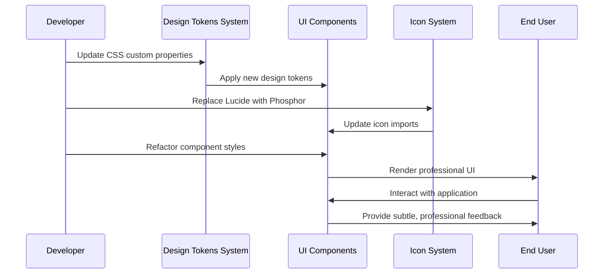
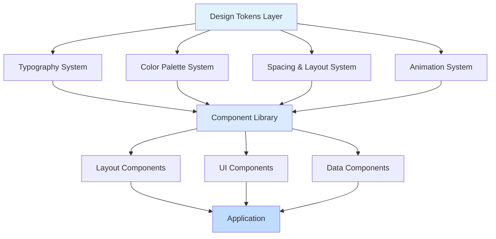

# Design Document: Remove AI Slop Design

## Overview

This design document outlines the technical approach to remove AI-generated template design elements (AI slop) from the Multi Kreasi Printing web application and replace them with professional, business-focused design. The implementation will maintain the existing React + TypeScript + Tailwind CSS v4 architecture while introducing a new design system that prioritizes data density, professional aesthetics, and business functionality over decorative visual elements.

## Main Algorithm/Workflow



## Architecture

### Design System Layers



## Core Interfaces/Types

### Design Token Configuration

```typescript
// frontend/src/styles/design-tokens.ts

interface ColorToken {
  50: string;
  100: string;
  200: string;
  300: string;
  400: string;
  500: string;
  600: string;
  700: string;
  800: string;
  900: string;
  950: string;
}

interface DesignTokens {
  colors: {
    primary: ColorToken;
    neutral: ColorToken;
    success: ColorToken;
    warning: ColorToken;
    error: ColorToken;
    info: ColorToken;
  };
  typography: {
    fontFamily: {
      sans: string;
      mono: string;
    };
    fontSize: Record<string, string>;
    fontWeight: Record<string, number>;
    lineHeight: Record<string, number>;
  };
  spacing: Record<string, string>;
  borderRadius: Record<string, string>;
  shadow: Record<string, string>;
  animation: {
    duration: Record<string, string>;
    easing: Record<string, string>;
  };
}

export const designTokens: DesignTokens = {
  colors: {
    primary: {
      50: '#f0f9ff',
      100: '#e0f2fe',
      200: '#bae6fd',
      300: '#7dd3fc',
      400: '#38bdf8',
      500: '#0ea5e9',
      600: '#0284c7',
      700: '#0369a1',
      800: '#075985',
      900: '#0c4a6e',
      950: '#082f49'
    },
    neutral: {
      50: '#fafbfc',
      100: '#f4f6f8',
      200: '#e5e9ed',
      300: '#d1d7de',
      400: '#a3aeba',
      500: '#7b8794',
      600: '#5a6775',
      700: '#424c58',
      800: '#2f3842',
      900: '#1e2329',
      950: '#0f1419'
    },
    success: {
      50: '#f0fdf4',
      100: '#dcfce7',
      200: '#bbf7d0',
      300: '#86efac',
      400: '#4ade80',
      500: '#22c55e',
      600: '#16a34a',
      700: '#15803d',
      800: '#166534',
      900: '#14532d',
      950: '#052e16'
    },
    warning: {
      50: '#fffbeb',
      100: '#fef3c7',
      200: '#fde68a',
      300: '#fcd34d',
      400: '#fbbf24',
      500: '#f59e0b',
      600: '#d97706',
      700: '#b45309',
      800: '#92400e',
      900: '#78350f',
      950: '#451a03'
    },
    error: {
      50: '#fef2f2',
      100: '#fee2e2',
      200: '#fecaca',
      300: '#fca5a5',
      400: '#f87171',
      500: '#ef4444',
      600: '#dc2626',
      700: '#b91c1c',
      800: '#991b1b',
      900: '#7f1d1d',
      950: '#450a0a'
    },
    info: {
      50: '#eff6ff',
      100: '#dbeafe',
      200: '#bfdbfe',
      300: '#93c5fd',
      400: '#60a5fa',
      500: '#3b82f6',
      600: '#2563eb',
      700: '#1d4ed8',
      800: '#1e40af',
      900: '#1e3a8a',
      950: '#172554'
    }
  },
  typography: {
    fontFamily: {
      sans: '"IBM Plex Sans", "Work Sans", -apple-system, BlinkMacSystemFont, "Segoe UI", system-ui, sans-serif',
      mono: '"IBM Plex Mono", "SF Mono", "Consolas", monospace'
    },
    fontSize: {
      xs: '0.75rem',    // 12px
      sm: '0.875rem',   // 14px
      base: '1rem',     // 16px
      lg: '1.125rem',   // 18px
      xl: '1.25rem',    // 20px
      '2xl': '1.5rem',  // 24px
      '3xl': '1.875rem',// 30px
      '4xl': '2.25rem', // 36px
      '5xl': '3rem'     // 48px
    },
    fontWeight: {
      normal: 400,
      medium: 500,
      semibold: 600,
      bold: 700
    },
    lineHeight: {
      tight: 1.25,
      normal: 1.5,
      relaxed: 1.75
    }
  },
  spacing: {
    1: '0.25rem',   // 4px
    2: '0.5rem',    // 8px
    3: '0.75rem',   // 12px
    4: '1rem',      // 16px
    5: '1.25rem',   // 20px
    6: '1.5rem',    // 24px
    8: '2rem',      // 32px
    10: '2.5rem',   // 40px
    12: '3rem',     // 48px
    16: '4rem',     // 64px
    20: '5rem',     // 80px
    24: '6rem'      // 96px
  },
  borderRadius: {
    sm: '0.25rem',  // 4px
    md: '0.375rem', // 6px
    lg: '0.5rem',   // 8px
    xl: '0.75rem',  // 12px
    full: '9999px'
  },
  shadow: {
    sm: '0 1px 2px 0 rgba(0, 0, 0, 0.05)',
    md: '0 2px 4px -1px rgba(0, 0, 0, 0.06), 0 1px 2px -1px rgba(0, 0, 0, 0.04)',
    lg: '0 4px 6px -2px rgba(0, 0, 0, 0.05), 0 2px 4px -2px rgba(0, 0, 0, 0.03)'
  },
  animation: {
    duration: {
      fast: '100ms',
      normal: '150ms',
      slow: '200ms'
    },
    easing: {
      standard: 'cubic-bezier(0.4, 0.0, 0.2, 1)',
      decelerate: 'cubic-bezier(0.0, 0.0, 0.2, 1)',
      accelerate: 'cubic-bezier(0.4, 0.0, 1, 1)'
    }
  }
};
```

### Icon System Interface

```typescript
// frontend/src/components/icons/types.ts

export interface IconProps {
  size?: number | string;
  color?: string;
  weight?: 'thin' | 'light' | 'regular' | 'bold' | 'fill';
  className?: string;
  'aria-label'?: string;
}

export type IconComponent = React.FC<IconProps>;

// Icon mapping for migration from Lucide to Phosphor
export interface IconMigrationMap {
  lucideName: string;
  phosphorName: string;
  phosphorImport: string;
}
```

### Component Style Props

```typescript
// frontend/src/types/component-styles.ts

export interface BaseComponentProps {
  variant?: 'primary' | 'secondary' | 'ghost' | 'danger';
  size?: 'sm' | 'md' | 'lg';
  disabled?: boolean;
  loading?: boolean;
  className?: string;
}

export interface NavigationItemProps extends BaseComponentProps {
  icon: React.ReactNode;
  label: string;
  path: string;
  isActive: boolean;
  badge?: number | string;
}

export interface MetricCardProps {
  title: string;
  value: string | number;
  trend?: {
    value: number;
    isPositive: boolean;
    label: string;
  };
  icon?: React.ReactNode;
  variant?: 'default' | 'compact';
}
```

## Key Functions with Formal Specifications

### Function 1: applyDesignTokens()

```typescript
function applyDesignTokens(element: HTMLElement, tokens: DesignTokens): void
```

**Preconditions:**
- `element` is a valid DOM element
- `tokens` is a well-formed DesignTokens object
- All token values are valid CSS values

**Postconditions:**
- CSS custom properties are set on the element
- Token values are applied to the document root
- Design system is globally available via CSS variables
- No side effects on other elements

**Loop Invariants:** N/A (no loops)

### Function 2: migrateIconImports()

```typescript
function migrateIconImports(
  sourceFile: string,
  migrationMap: IconMigrationMap[]
): string
```

**Preconditions:**
- `sourceFile` is valid TypeScript/TSX source code
- `migrationMap` contains valid Lucide to Phosphor mappings
- Source file contains Lucide icon imports

**Postconditions:**
- Returns updated source code with Phosphor imports
- All Lucide imports are replaced with Phosphor equivalents
- JSX usage of icons is updated with new prop names
- Code remains syntactically valid TypeScript

**Loop Invariants:**
- For migration loops: All previously processed imports remain valid
- Icon name mappings are bijective (one-to-one)

### Function 3: calculateContrastRatio()

```typescript
function calculateContrastRatio(
  foreground: string,
  background: string
): number
```

**Preconditions:**
- `foreground` is a valid CSS color value
- `background` is a valid CSS color value
- Both colors can be parsed to RGB

**Postconditions:**
- Returns contrast ratio between 1 and 21
- Result conforms to WCAG contrast calculation algorithm
- Return value >= 4.5 indicates WCAG AA compliance for normal text
- No mutations to input parameters

**Loop Invariants:** N/A (no loops)

### Function 4: generateSkeletonLoader()

```typescript
function generateSkeletonLoader(
  contentShape: SkeletonShape
): React.ReactElement
```

**Preconditions:**
- `contentShape` is a valid skeleton shape definition
- Shape contains dimensions and element types

**Postconditions:**
- Returns valid React element with skeleton styling
- Skeleton matches content structure
- Animation is applied with proper timing
- Component is accessible (proper ARIA attributes)

**Loop Invariants:**
- When iterating over shape elements: All generated elements maintain consistent styling

## Algorithmic Pseudocode

### Design Token Application Algorithm

```typescript
// Algorithm: Apply Design Tokens to Application
// INPUT: DesignTokens object
// OUTPUT: Updated CSS custom properties on :root

function applyDesignTokensToRoot(tokens: DesignTokens): void {
  // PRECONDITION: tokens is valid DesignTokens object
  const root = document.documentElement;
  
  // Step 1: Apply color tokens
  Object.entries(tokens.colors).forEach(([category, shades]) => {
    Object.entries(shades).forEach(([shade, value]) => {
      root.style.setProperty(`--color-${category}-${shade}`, value);
    });
  });
  // INVARIANT: All color tokens are valid CSS color values
  
  // Step 2: Apply typography tokens
  root.style.setProperty('--font-sans', tokens.typography.fontFamily.sans);
  root.style.setProperty('--font-mono', tokens.typography.fontFamily.mono);
  
  Object.entries(tokens.typography.fontSize).forEach(([size, value]) => {
    root.style.setProperty(`--text-${size}`, value);
  });
  // INVARIANT: All typography tokens produce valid CSS
  
  // Step 3: Apply spacing tokens
  Object.entries(tokens.spacing).forEach(([key, value]) => {
    root.style.setProperty(`--space-${key}`, value);
  });
  
  // Step 4: Apply border radius tokens
  Object.entries(tokens.borderRadius).forEach(([key, value]) => {
    root.style.setProperty(`--radius-${key}`, value);
  });
  
  // Step 5: Apply shadow tokens
  Object.entries(tokens.shadow).forEach(([key, value]) => {
    root.style.setProperty(`--shadow-${key}`, value);
  });
  
  // Step 6: Apply animation tokens
  Object.entries(tokens.animation.duration).forEach(([key, value]) => {
    root.style.setProperty(`--duration-${key}`, value);
  });
  
  Object.entries(tokens.animation.easing).forEach(([key, value]) => {
    root.style.setProperty(`--easing-${key}`, value);
  });
  
  // POSTCONDITION: All design tokens are available as CSS custom properties
}
```

**Preconditions:**
- tokens parameter is a valid DesignTokens object
- document.documentElement exists
- All token values are valid CSS values

**Postconditions:**
- All design tokens are set as CSS custom properties on :root
- Token values are accessible via var(--token-name) in CSS
- No existing custom properties are corrupted
- Application can reference tokens consistently

**Loop Invariants:**
- All previously set CSS custom properties remain valid
- Token naming convention is consistent throughout iteration
- No duplicate token names are created

### Icon Migration Algorithm

```typescript
// Algorithm: Migrate Lucide Icons to Phosphor Icons
// INPUT: Component source code, migration map
// OUTPUT: Updated source code with Phosphor icons

function migrateIconsInComponent(
  sourceCode: string,
  migrationMap: IconMigrationMap[]
): string {
  // PRECONDITION: sourceCode is valid TypeScript/TSX
  // PRECONDITION: migrationMap contains valid mappings
  
  let updatedCode = sourceCode;
  
  // Step 1: Replace import statements
  const lucideImportRegex = /import\s*{\s*([^}]+)\s*}\s*from\s*['"]lucide-react['"]/g;
  
  updatedCode = updatedCode.replace(lucideImportRegex, (match, imports) => {
    const importList = imports.split(',').map((i: string) => i.trim());
    const phosphorImports: string[] = [];
    
    // FOR each Lucide import, find Phosphor equivalent
    importList.forEach((lucideImport: string) => {
      const mapping = migrationMap.find(m => m.lucideName === lucideImport);
      if (mapping) {
        phosphorImports.push(mapping.phosphorName);
      }
    });
    // INVARIANT: All valid Lucide icons have Phosphor equivalents
    
    return `import { ${phosphorImports.join(', ')} } from '@phosphor-icons/react'`;
  });
  
  // Step 2: Update JSX usage (Lucide uses size prop, Phosphor uses size and weight)
  migrationMap.forEach((mapping) => {
    // Replace component usage
    const lucideComponentRegex = new RegExp(
      `<${mapping.lucideName}([^/>]*)/?>`,
      'g'
    );
    
    updatedCode = updatedCode.replace(lucideComponentRegex, (match, props) => {
      // Phosphor uses 'weight' prop instead of Lucide's implicit stroke-width
      const hasWeight = props.includes('weight=');
      const weightProp = hasWeight ? '' : ' weight="regular"';
      
      return `<${mapping.phosphorName}${props}${weightProp}${match.endsWith('/>') ? '/>' : '>'}`;
    });
  });
  // INVARIANT: All icon replacements maintain valid JSX syntax
  
  // POSTCONDITION: All Lucide icons are replaced with Phosphor equivalents
  // POSTCONDITION: Code remains syntactically valid
  return updatedCode;
}
```

**Preconditions:**
- sourceCode is valid TypeScript/TSX source code
- migrationMap contains all icons used in the source code
- All Lucide icons have corresponding Phosphor equivalents

**Postconditions:**
- All Lucide imports are replaced with Phosphor imports
- All Lucide component usages are replaced with Phosphor components
- Code remains syntactically valid TypeScript/TSX
- Icon props are correctly translated (size, weight, etc.)

**Loop Invariants:**
- Each iteration maintains valid import syntax
- Icon name mappings remain consistent
- Previously processed icons remain correctly migrated

### Sidebar Navigation State Algorithm

```typescript
// Algorithm: Determine Active Navigation Item
// INPUT: Current pathname, menu items
// OUTPUT: Updated menu items with active state

function determineActiveNavigationItem(
  pathname: string,
  menuItems: NavigationItemProps[]
): NavigationItemProps[] {
  // PRECONDITION: pathname is valid URL path
  // PRECONDITION: menuItems is non-empty array
  
  return menuItems.map((item) => {
    // Exact match check
    if (pathname === item.path) {
      return { ...item, isActive: true };
    }
    
    // Prefix match check (for nested routes)
    // Special case: /dashboard should not match /dashboard/orders
    if (item.path !== '/dashboard' && pathname.startsWith(item.path)) {
      return { ...item, isActive: true };
    }
    
    return { ...item, isActive: false };
  });
  // INVARIANT: Exactly one or zero items are active
  // POSTCONDITION: Active state correctly reflects current route
}
```

**Preconditions:**
- pathname is a valid URL path string
- menuItems array is not empty
- All menu item paths are well-formed

**Postconditions:**
- Returns new array with updated isActive flags
- At most one item has isActive: true
- Original menuItems array is not mutated
- Active item corresponds to current route

**Loop Invariants:**
- All processed items have valid isActive boolean
- Path matching logic remains consistent

## Components and Interfaces

### 1. Design Token CSS Layer

**Purpose**: Provide centralized design token definitions accessible throughout the application

**Interface**:
```css
/* frontend/src/styles/design-tokens.css */

:root {
  /* Typography System */
  --font-sans: "IBM Plex Sans", "Work Sans", system-ui, sans-serif;
  --font-mono: "IBM Plex Mono", "SF Mono", Consolas, monospace;
  
  /* Color Palette - Primary (Sky Blue) */
  --color-primary-50: #f0f9ff;
  --color-primary-100: #e0f2fe;
  --color-primary-500: #0ea5e9;
  --color-primary-600: #0284c7;
  --color-primary-700: #0369a1;
  
  /* Color Palette - Neutral (True Grays) */
  --color-neutral-50: #fafbfc;
  --color-neutral-100: #f4f6f8;
  --color-neutral-200: #e5e9ed;
  --color-neutral-600: #5a6775;
  --color-neutral-800: #2f3842;
  --color-neutral-900: #1e2329;
  
  /* Semantic Colors */
  --color-success: #22c55e;
  --color-warning: #f59e0b;
  --color-error: #ef4444;
  
  /* Background Surfaces */
  --bg-base: var(--color-neutral-50);
  --bg-elevated: #ffffff;
  --bg-overlay: rgba(0, 0, 0, 0.5);
  
  /* Text Colors */
  --text-primary: var(--color-neutral-900);
  --text-secondary: var(--color-neutral-600);
  --text-tertiary: var(--color-neutral-400);
  
  /* Borders */
  --border-color: var(--color-neutral-200);
  --border-radius-sm: 0.25rem;
  --border-radius-md: 0.375rem;
  --border-radius-lg: 0.5rem;
  
  /* Shadows - Subtle only */
  --shadow-sm: 0 1px 2px 0 rgba(0, 0, 0, 0.05);
  --shadow-md: 0 2px 4px -1px rgba(0, 0, 0, 0.06);
  
  /* Spacing Scale (4px grid) */
  --space-1: 0.25rem;
  --space-2: 0.5rem;
  --space-3: 0.75rem;
  --space-4: 1rem;
  --space-6: 1.5rem;
  --space-8: 2rem;
  
  /* Animation */
  --transition-fast: 100ms cubic-bezier(0.4, 0.0, 0.2, 1);
  --transition-normal: 150ms cubic-bezier(0.4, 0.0, 0.2, 1);
  --transition-slow: 200ms cubic-bezier(0.4, 0.0, 0.2, 1);
}

/* Respect user preferences for reduced motion */
@media (prefers-reduced-motion: reduce) {
  * {
    animation-duration: 0.01ms !important;
    transition-duration: 0.01ms !important;
  }
}
```

**Responsibilities**:
- Define all color values as CSS custom properties
- Provide consistent spacing scale
- Set typography system defaults
- Define animation timing and easing
- Support reduced motion preferences

### 2. Professional Sidebar Component

**Purpose**: Provide clean, efficient navigation without decorative colored stripes

**Interface**:
```typescript
interface SidebarProps {
  collapsed?: boolean;
  onCollapseToggle?: () => void;
  menuItems: NavigationItemProps[];
  currentPath: string;
}

const Sidebar: React.FC<SidebarProps>;
```

**Styling Specifications**:
```typescript
// Active state styling (NO colored stripe)
const activeItemClass = cn(
  "flex items-center gap-3 px-3 py-2.5 rounded-lg",
  "bg-neutral-100 text-neutral-900 font-medium",
  "border-l-2 border-primary-600" // Simple border, not colored stripe
);

// Inactive state
const inactiveItemClass = cn(
  "flex items-center gap-3 px-3 py-2.5 rounded-lg",
  "text-neutral-600 hover:bg-neutral-50 hover:text-neutral-900",
  "transition-colors duration-150"
);
```

**Responsibilities**:
- Display navigation menu with consistent spacing (minimum 8px)
- Indicate active state with background color and subtle border (not colored stripe)
- Show tooltips when collapsed
- Maintain minimum 14px font size for labels
- Provide smooth collapse/expand animation (max 200ms)

### 3. Professional Header Component

**Purpose**: Provide consistent top navigation without excessive visual effects

**Interface**:
```typescript
interface HeaderProps {
  user: User;
  role: UserRole;
  onLogout: () => void;
  onSearch?: (query: string) => void;
}

const Header: React.FC<HeaderProps>;
```

**Styling Specifications**:
```typescript
const headerClass = cn(
  "h-16 bg-white border-b border-neutral-200",
  "sticky top-0 z-30 px-6",
  "flex items-center justify-between",
  "shadow-sm" // Subtle shadow only
);
```

**Responsibilities**:
- Display breadcrumb navigation
- Provide search functionality
- Show user profile dropdown
- Display notifications
- Use subtle shadows (max 2px blur)
- Avoid gradients and excessive effects

### 4. Professional Dashboard Layout

**Purpose**: Display business metrics in data-first, asymmetric layout

**Interface**:
```typescript
interface DashboardLayoutProps {
  metrics: MetricCardProps[];
  charts: ChartData[];
  tables: TableData[];
}

const DashboardLayout: React.FC<DashboardLayoutProps>;
```

**Layout Structure**:
```typescript
// NOT: 3-column bento grid
// YES: Asymmetric, data-first layout

<div className="space-y-6">
  {/* Metric Row - 4 columns */}
  <div className="grid grid-cols-4 gap-6">
    {metrics.map(m => <MetricCard {...m} />)}
  </div>
  
  {/* Main Content - 2/3 + 1/3 split */}
  <div className="grid grid-cols-3 gap-6">
    <div className="col-span-2">
      <DataTable />
    </div>
    <div className="col-span-1">
      <StatusPanel />
    </div>
  </div>
  
  {/* Charts Row - 1/2 + 1/2 */}
  <div className="grid grid-cols-2 gap-6">
    <RevenueChart />
    <OrdersChart />
  </div>
</div>
```

**Responsibilities**:
- Prioritize data density over visual decoration
- Use asymmetric grid (not bento grid)
- Display real production data
- Avoid marketing clichés (emojis, checkmarks, pricing tiers)
- Maintain clear visual hierarchy

### 5. Skeleton Loader Component

**Purpose**: Provide professional loading states matching content structure

**Interface**:
```typescript
interface SkeletonProps {
  variant: 'text' | 'card' | 'table' | 'chart';
  rows?: number;
  className?: string;
}

const Skeleton: React.FC<SkeletonProps>;
```

**Animation Specification**:
```typescript
const skeletonAnimation = {
  animation: 'pulse 1.5s cubic-bezier(0.4, 0.0, 0.6, 1) infinite',
};

// NOT: Rainbow spinner or neon indicators
// YES: Subtle pulse animation matching content shape
```

**Responsibilities**:
- Match skeleton shape to actual content structure
- Use subtle pulse animation (1.5s duration)
- Maintain sufficient contrast (WCAG AA minimum)
- Provide smooth transition when content loads
- Avoid jarring flashes or color changes

### 6. Icon System Component

**Purpose**: Provide consistent, professional icon system using Phosphor Icons

**Interface**:
```typescript
type IconWeight = 'thin' | 'light' | 'regular' | 'bold' | 'fill';

interface IconWrapperProps {
  icon: React.ComponentType<{ size?: number; weight?: IconWeight }>;
  size?: number;
  weight?: IconWeight;
  className?: string;
}

const IconWrapper: React.FC<IconWrapperProps>;
```

**Migration Map**:
```typescript
const LUCIDE_TO_PHOSPHOR_MAP: Record<string, string> = {
  // Navigation
  'LayoutDashboard': 'SquaresFour',
  'ShoppingCart': 'ShoppingCart',
  'Factory': 'Factory',
  'Users': 'Users',
  'FileText': 'FileText',
  'Package': 'Package',
  'Palette': 'Palette',
  'Settings': 'Gear',
  
  // Actions
  'Search': 'MagnifyingGlass',
  'Bell': 'Bell',
  'Menu': 'List',
  'ChevronDown': 'CaretDown',
  'ChevronLeft': 'CaretLeft',
  'ChevronRight': 'CaretRight',
  'LogOut': 'SignOut',
  'Check': 'Check',
  'X': 'X',
  
  // Status
  'BarChart3': 'ChartBar',
  'ScrollText': 'Scroll',
  'ClipboardList': 'ClipboardText',
  'Store': 'Storefront'
};
```

**Responsibilities**:
- Maintain consistent stroke width across all icons
- Use consistent sizing (16px or 20px for navigation)
- Avoid sparkle icons or animated arrows
- Provide accessible labels
- Support multiple weights (regular, bold)

## Data Models

### Color Palette Model

```typescript
interface ColorPalette {
  primary: {
    main: string;      // Sky Blue #0ea5e9
    hover: string;     // Sky Blue Dark #0284c7
    light: string;     // Sky Blue Light #e0f2fe
  };
  neutral: {
    50: string;        // Base background #fafbfc
    100: string;       // Elevated surface #f4f6f8
    200: string;       // Border color #e5e9ed
    600: string;       // Secondary text #5a6775
    900: string;       // Primary text #1e2329
  };
  semantic: {
    success: string;   // Green #22c55e
    warning: string;   // Amber #f59e0b
    error: string;     // Red #ef4444
  };
}
```

**Validation Rules**:
- All colors must pass WCAG AA contrast requirements (4.5:1 for normal text)
- No purple/black combinations
- No rainbow coloring
- No neon colors
- No basic pastels
- Must use hex format for consistency

### Typography Model

```typescript
interface TypographyScale {
  fontFamily: {
    sans: string;      // IBM Plex Sans or Work Sans
    mono: string;      // IBM Plex Mono
  };
  sizes: {
    xs: string;        // 12px - Small labels
    sm: string;        // 14px - Body text
    base: string;      // 16px - Default
    lg: string;        // 18px - Subheadings
    xl: string;        // 20px - Headings
    '2xl': string;     // 24px - Page titles
    '3xl': string;     // 30px - Hero text
  };
  weights: {
    normal: 400;
    medium: 500;
    semibold: 600;
    bold: 700;
  };
  lineHeight: {
    tight: 1.25;
    normal: 1.5;
    relaxed: 1.75;
  };
}
```

**Validation Rules**:
- Must NOT use Inter, Geist, or Space Grotesk
- Line height between 1.4 and 1.6 for body text
- Clear hierarchy with minimum 5 levels
- Consistent font weights (400, 500, 600, 700)

### Spacing Scale Model

```typescript
interface SpacingScale {
  1: '4px';
  2: '8px';
  3: '12px';
  4: '16px';
  5: '20px';
  6: '24px';
  8: '32px';
  10: '40px';
  12: '48px';
  16: '64px';
}
```

**Validation Rules**:
- Must follow 4px grid system
- Minimum spacing between menu items: 8px
- Consistent application across all components

## Error Handling

### Error Scenario 1: Icon Migration Failure

**Condition**: Lucide icon has no Phosphor equivalent in migration map
**Response**: Log warning and keep Lucide icon temporarily with TODO comment
**Recovery**: Manually select appropriate Phosphor icon and update migration map

```typescript
function migrateIconSafely(lucideName: string, map: IconMigrationMap[]): string {
  const mapping = map.find(m => m.lucideName === lucideName);
  
  if (!mapping) {
    console.warn(`No Phosphor equivalent found for Lucide icon: ${lucideName}`);
    // Keep Lucide temporarily
    return `{/* TODO: Replace ${lucideName} with Phosphor icon */}
            <${lucideName} />`;
  }
  
  return `<${mapping.phosphorName} weight="regular" />`;
}
```

### Error Scenario 2: Contrast Ratio Validation Failure

**Condition**: Color combination fails WCAG AA contrast requirements (< 4.5:1)
**Response**: Reject color selection and suggest alternative
**Recovery**: Provide darker/lighter variant that meets contrast requirements

```typescript
function validateColorContrast(
  foreground: string,
  background: string
): ValidationResult {
  const ratio = calculateContrastRatio(foreground, background);
  
  if (ratio < 4.5) {
    return {
      valid: false,
      message: `Contrast ratio ${ratio.toFixed(2)}:1 is below WCAG AA standard (4.5:1)`,
      suggestion: generateAccessibleAlternative(foreground, background)
    };
  }
  
  return { valid: true };
}
```

### Error Scenario 3: Font Loading Failure

**Condition**: IBM Plex Sans or Work Sans fails to load from CDN
**Response**: Fall back to system font stack
**Recovery**: Attempt to reload font or use local font files

```typescript
// CSS fallback
@font-face {
  font-family: 'IBM Plex Sans';
  src: url('/fonts/IBMPlexSans-Regular.woff2') format('woff2');
  font-display: swap; /* Show fallback immediately */
}

body {
  font-family: 'IBM Plex Sans', 'Work Sans', -apple-system, BlinkMacSystemFont, 'Segoe UI', system-ui, sans-serif;
}
```

### Error Scenario 4: Animation Performance Issues

**Condition**: User reports lag or choppy animations
**Response**: Check prefers-reduced-motion and disable animations if needed
**Recovery**: Simplify animations or use transform-based animations only

```typescript
// Respect user preferences
@media (prefers-reduced-motion: reduce) {
  * {
    animation-duration: 0.01ms !important;
    transition-duration: 0.01ms !important;
  }
}

// Use GPU-accelerated properties only
.sidebar-item {
  transition: transform 150ms cubic-bezier(0.4, 0.0, 0.2, 1);
  /* NOT: transition: width, height, left, top (causes reflow) */
}
```

## Testing Strategy

### Unit Testing Approach

**Design Token Tests**:
```typescript
describe('Design Tokens', () => {
  it('should export all required color tokens', () => {
    expect(designTokens.colors.primary).toBeDefined();
    expect(designTokens.colors.neutral).toBeDefined();
    expect(designTokens.colors.success).toBeDefined();
  });
  
  it('should not include purple/black color scheme', () => {
    const allColors = Object.values(designTokens.colors).flat();
    const hasPurple = allColors.some(c => c.includes('purple'));
    expect(hasPurple).toBe(false);
  });
  
  it('should use IBM Plex Sans or Work Sans', () => {
    const fontFamily = designTokens.typography.fontFamily.sans;
    expect(fontFamily).toMatch(/IBM Plex Sans|Work Sans/);
    expect(fontFamily).not.toMatch(/Inter|Geist|Space Grotesk/);
  });
});
```

**Contrast Ratio Tests**:
```typescript
describe('Color Contrast', () => {
  it('should meet WCAG AA standards for all text colors', () => {
    const textColors = [
      designTokens.colors.neutral[900], // Primary text
      designTokens.colors.neutral[600], // Secondary text
    ];
    
    const backgrounds = [
      designTokens.colors.neutral[50],  // Base background
      designTokens.colors.neutral[100], // Elevated surface
    ];
    
    textColors.forEach(text => {
      backgrounds.forEach(bg => {
        const ratio = calculateContrastRatio(text, bg);
        expect(ratio).toBeGreaterThanOrEqual(4.5);
      });
    });
  });
});
```

**Component Style Tests**:
```typescript
describe('Sidebar Component', () => {
  it('should not use colored left stripe for active state', () => {
    const { container } = render(<Sidebar menuItems={mockItems} currentPath="/dashboard" />);
    const activeItem = container.querySelector('[data-active="true"]');
    
    const styles = window.getComputedStyle(activeItem!);
    // Check that border is simple, not a colored stripe
    expect(styles.borderLeftWidth).toBe('2px');
    expect(styles.borderLeftColor).not.toMatch(/purple|gradient/);
  });
  
  it('should use minimum 8px spacing between menu items', () => {
    const { container } = render(<Sidebar menuItems={mockItems} currentPath="/dashboard" />);
    const menuItems = container.querySelectorAll('.menu-item');
    
    for (let i = 0; i < menuItems.length - 1; i++) {
      const currentRect = menuItems[i].getBoundingClientRect();
      const nextRect = menuItems[i + 1].getBoundingClientRect();
      const gap = nextRect.top - currentRect.bottom;
      expect(gap).toBeGreaterThanOrEqual(8);
    }
  });
});
```

### Property-Based Testing Approach

**Property Test Library**: fast-check (for TypeScript)

**Color Palette Properties**:
```typescript
import fc from 'fast-check';

describe('Color Palette Properties', () => {
  it('all color values should be valid hex colors', () => {
    fc.assert(
      fc.property(
        fc.constantFrom(...Object.values(designTokens.colors).flat()),
        (color) => {
          expect(color).toMatch(/^#[0-9a-f]{6}$/i);
        }
      )
    );
  });
  
  it('all color combinations should meet minimum contrast', () => {
    const textColors = Object.values(designTokens.colors.neutral).filter((_, i) => i >= 6);
    const bgColors = Object.values(designTokens.colors.neutral).filter((_, i) => i <= 2);
    
    fc.assert(
      fc.property(
        fc.constantFrom(...textColors),
        fc.constantFrom(...bgColors),
        (text, bg) => {
          const ratio = calculateContrastRatio(text, bg);
          expect(ratio).toBeGreaterThanOrEqual(4.5);
        }
      )
    );
  });
});
```

**Animation Duration Properties**:
```typescript
describe('Animation Duration Properties', () => {
  it('all animations should not exceed 200ms', () => {
    const durations = Object.values(designTokens.animation.duration);
    
    fc.assert(
      fc.property(
        fc.constantFrom(...durations),
        (duration) => {
          const ms = parseInt(duration);
          expect(ms).toBeLessThanOrEqual(200);
        }
      )
    );
  });
});
```

### Integration Testing Approach

**Full Page Rendering Tests**:
```typescript
describe('Dashboard Integration', () => {
  it('should render without AI slop elements', async () => {
    render(<Dashboard />);
    
    // Check no bento grid layout
    const bentoGrid = screen.queryByTestId('bento-grid');
    expect(bentoGrid).toBeNull();
    
    // Check no emojis in interface
    const content = screen.getByRole('main').textContent;
    const hasEmoji = /[\u{1F300}-\u{1F9FF}]/u.test(content || '');
    expect(hasEmoji).toBe(false);
    
    // Check no rainbow spinners
    const spinner = screen.queryByTestId('rainbow-spinner');
    expect(spinner).toBeNull();
    
    // Check professional loading states
    const skeletons = screen.queryAllByTestId('skeleton-loader');
    expect(skeletons.length).toBeGreaterThan(0);
  });
  
  it('should use Phosphor icons instead of Lucide', () => {
    const { container } = render(<Sidebar />);
    
    // Phosphor icons use <svg> with phosphor-icon class
    const phosphorIcons = container.querySelectorAll('svg[class*="phosphor"]');
    expect(phosphorIcons.length).toBeGreaterThan(0);
    
    // Lucide icons should not be present
    const lucideIcons = container.querySelectorAll('svg[class*="lucide"]');
    expect(lucideIcons.length).toBe(0);
  });
});
```

**Accessibility Tests**:
```typescript
import { axe } from 'jest-axe';

describe('Accessibility Compliance', () => {
  it('should have no accessibility violations', async () => {
    const { container } = render(<App />);
    const results = await axe(container);
    expect(results).toHaveNoViolations();
  });
  
  it('should respect prefers-reduced-motion', () => {
    window.matchMedia = jest.fn().mockImplementation(query => ({
      matches: query === '(prefers-reduced-motion: reduce)',
      media: query,
    }));
    
    const { container } = render(<Dashboard />);
    const animated = container.querySelectorAll('[class*="animate"]');
    
    animated.forEach(el => {
      const styles = window.getComputedStyle(el);
      expect(parseFloat(styles.animationDuration)).toBeLessThan(0.1);
    });
  });
});
```

## Performance Considerations

### Font Loading Strategy

**Problem**: Custom fonts (IBM Plex Sans, Work Sans) can cause FOUT (Flash of Unstyled Text)

**Solution**: Use font-display: swap and preload critical fonts

```html
<!-- In index.html -->
<link rel="preconnect" href="https://fonts.googleapis.com">
<link rel="preconnect" href="https://fonts.gstatic.com" crossorigin>
<link rel="preload" as="style" href="https://fonts.googleapis.com/css2?family=IBM+Plex+Sans:wght@400;500;600;700&display=swap">
```

```css
/* In design-tokens.css */
@font-face {
  font-family: 'IBM Plex Sans';
  font-display: swap; /* Show fallback immediately, swap when loaded */
  src: url('...') format('woff2');
}
```

### Icon Bundle Size Optimization

**Problem**: Importing entire Phosphor Icons library increases bundle size

**Solution**: Use tree-shaking and import only required icons

```typescript
// BAD: Imports entire library
import * as PhosphorIcons from '@phosphor-icons/react';

// GOOD: Import only what's needed
import { 
  SquaresFour,
  ShoppingCart,
  Factory,
  Users 
} from '@phosphor-icons/react';
```

**Expected Impact**: Reduce icon bundle size from ~200KB to ~20KB

### Animation Performance

**Problem**: Animating layout properties (width, height, left, top) causes reflow

**Solution**: Use GPU-accelerated properties only (transform, opacity)

```css
/* BAD: Causes reflow */
.sidebar-item {
  transition: width 200ms, margin-left 200ms;
}

/* GOOD: GPU-accelerated */
.sidebar-item {
  transition: transform 150ms cubic-bezier(0.4, 0.0, 0.2, 1);
  will-change: transform; /* Hint to browser */
}
```

### Design Token CSS Variables

**Problem**: CSS custom properties have slight performance overhead vs static values

**Solution**: Use CSS custom properties for theming, but limit nesting depth

```css
/* GOOD: Shallow nesting */
:root {
  --color-primary: #0ea5e9;
  --text-color: var(--color-neutral-900);
}

/* AVOID: Deep nesting */
:root {
  --base: #000;
  --level-1: var(--base);
  --level-2: var(--level-1);
  --level-3: var(--level-2); /* Too deep */
}
```

## Security Considerations

### Font Loading from CDN

**Threat**: Third-party CDN compromise could inject malicious fonts

**Mitigation**: Use Subresource Integrity (SRI) hashes for font files

```html
<link 
  href="https://fonts.googleapis.com/css2?family=IBM+Plex+Sans:wght@400;500;600;700&display=swap"
  rel="stylesheet"
  integrity="sha384-..."
  crossorigin="anonymous"
>
```

### CSS Injection Prevention

**Threat**: User-controlled style values could inject malicious CSS

**Mitigation**: Sanitize all user-provided style inputs

```typescript
function sanitizeColorValue(color: string): string {
  // Only allow hex colors
  if (!/^#[0-9a-f]{6}$/i.test(color)) {
    throw new Error('Invalid color format');
  }
  return color;
}

// Usage
const userColor = sanitizeColorValue(userInput);
element.style.setProperty('--user-color', userColor);
```

### XSS via Icon Names

**Threat**: Dynamic icon names from user input could cause XSS

**Mitigation**: Use allowlist validation for icon names

```typescript
const ALLOWED_ICONS = new Set([
  'SquaresFour',
  'ShoppingCart',
  'Factory',
  // ... all valid icons
]);

function getIconComponent(iconName: string): React.ComponentType {
  if (!ALLOWED_ICONS.has(iconName)) {
    throw new Error('Invalid icon name');
  }
  
  return PhosphorIcons[iconName as keyof typeof PhosphorIcons];
}
```

## Dependencies

### Required NPM Packages

```json
{
  "dependencies": {
    "@phosphor-icons/react": "^2.0.15",
    "react": "^19.2.8",
    "react-dom": "^19.2.8"
  },
  "devDependencies": {
    "@tailwindcss/postcss": "^4.3.3",
    "tailwindcss": "^4.3.3"
  }
}
```

### Font Dependencies

- **IBM Plex Sans**: Google Fonts or self-hosted WOFF2 files
- **Work Sans** (alternative): Google Fonts or self-hosted
- **IBM Plex Mono**: For code/monospace content

### Removed Dependencies

- ❌ `lucide-react`: Replaced with `@phosphor-icons/react`
- ❌ Inter font: Replaced with IBM Plex Sans
- ❌ Any gradient/effect libraries

### Design Tool Dependencies

- **Figma** (optional): For design token documentation
- **Contrast Checker**: For WCAG compliance validation
- **Lighthouse**: For accessibility and performance testing

## Implementation Phases

### Phase 1: Design Token Foundation (Week 1)
1. Create new `design-tokens.css` with professional color palette
2. Update `index.css` to import design tokens
3. Remove Inter font, add IBM Plex Sans
4. Define spacing, typography, and shadow systems
5. Test contrast ratios for WCAG compliance

### Phase 2: Icon System Migration (Week 1-2)
1. Install `@phosphor-icons/react` package
2. Create icon migration map (Lucide → Phosphor)
3. Update all components to use Phosphor icons
4. Remove `lucide-react` dependency
5. Verify icon consistency across application

### Phase 3: Component Redesign (Week 2-3)
1. Redesign Sidebar without colored stripes
2. Update Header with subtle shadows only
3. Refactor Dashboard to asymmetric, data-first layout
4. Remove bento grids, 3-column layouts
5. Update MetricCard components

### Phase 4: Animation Reduction (Week 3)
1. Audit all animations, remove excessive effects
2. Implement 200ms maximum duration
3. Add prefers-reduced-motion support
4. Use GPU-accelerated properties only
5. Remove hover animations exceeding limits

### Phase 5: Loading States (Week 3-4)
1. Create Skeleton loader components
2. Replace rainbow spinners with skeleton loaders
3. Match skeleton shapes to content structure
4. Implement smooth transitions
5. Test loading performance

### Phase 6: Legal Pages (Week 4)
1. Create Terms of Service page
2. Create Privacy Policy page
3. Create Help/Support page
4. Add footer with legal links
5. Format content for readability

### Phase 7: Testing & Validation (Week 4-5)
1. Run accessibility audit (axe, Lighthouse)
2. Test contrast ratios
3. Verify no AI slop elements remain
4. Performance testing
5. Cross-browser testing

## Correctness Properties

### Property 1: Typography Compliance
**Validates: Requirements 1**

**∀ text elements t in Application**: t uses (IBM Plex Sans OR Work Sans OR system fonts) AND t does NOT use (Inter OR Geist OR Space Grotesk)

### Property 2: Color Palette Compliance
**Validates: Requirements 2**

**∀ color c in ColorPalette**: c is NOT (purple-black combination OR rainbow coloring OR neon color OR basic pastel) AND ContrastRatio(c, background) ≥ 4.5

### Property 3: Icon System Consistency
**Validates: Requirements 3**

**∀ icons i in Components**: i is Phosphor icon AND strokeWidth(i) is consistent AND size(i) ∈ {16px, 20px}

### Property 4: Visual Effects Limit
**Validates: Requirements 4**

**∀ visual effects e in UI**: blur(e.shadow) ≤ 2px AND e does NOT use (harsh gradients OR liquid glass OR radial orbs OR dot grid backgrounds)

### Property 5: Dashboard Layout Uniqueness
**Validates: Requirements 5**

**∀ dashboard layouts l**: l does NOT use (3-column feature cards OR bento grid OR terminal mockups) AND l uses (asymmetric grid OR data-first layout)

### Property 6: Marketing Cliché Absence
**Validates: Requirements 6**

**∀ interface elements e**: e does NOT contain (emojis OR "It's not X, it's Y" pattern OR checkmark bullets OR 3 pricing tiers)

### Property 7: Sidebar Professional Design
**Validates: Requirements 7**

**∀ navigation items n in Sidebar**: activeState(n) uses (background color OR border) AND activeState(n) does NOT use (colored left stripe)

### Property 8: Animation Performance
**Validates: Requirements 8**

**∀ animations a in Components**: duration(a) ≤ 200ms AND easing(a) is cubic-bezier AND a respects prefers-reduced-motion

### Property 9: Background Comfort
**Validates: Requirements 9**

**∀ backgrounds b in Application**: b ≠ #FFFFFF (pure white) AND b ∈ {#F8F9FA, #FAFBFC, #F5F5F5} (neutral tones)

### Property 10: Loading State Professionalism
**Validates: Requirements 10**

**∀ loading states s**: s uses skeleton loader AND s does NOT use (rainbow spinner OR neon indicator) AND animationDuration(s) = 1.5s

### Property 11: Design Token Centralization
**Validates: Requirements 12**

**∀ design values v in Application**: v is defined in design-tokens.css OR design-tokens.ts AND v is accessible via CSS custom property OR TypeScript import

### Property 12: WCAG Accessibility Compliance
**Validates: Requirements 2, 9**

**∀ text-background pairs (t, b) in Application**: ContrastRatio(t, b) ≥ 4.5 (WCAG AA) OR ContrastRatio(t, b) ≥ 3.0 AND fontSize(t) ≥ 18px (large text exception)
