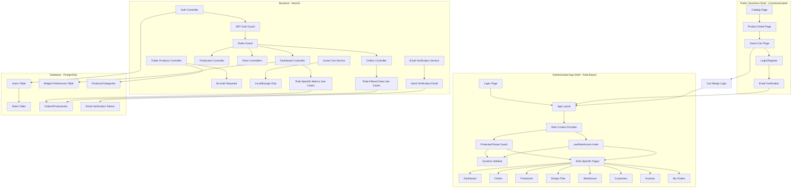
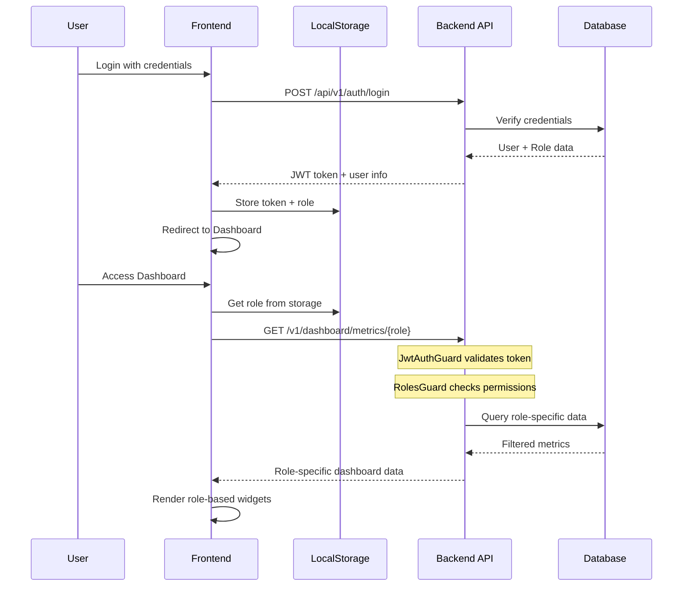
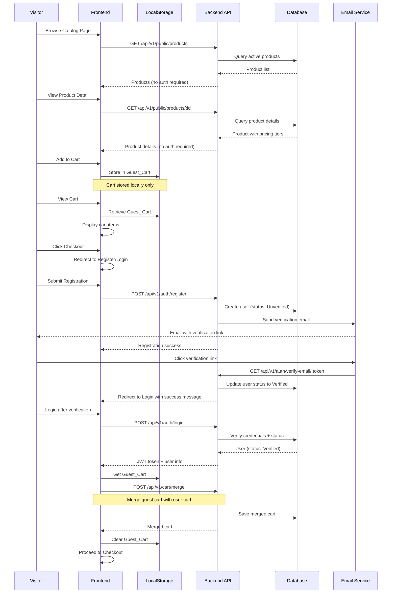

# Technical Design Document: Role-Based Pages

## Overview

This document describes the technical design for implementing role-specific pages and dashboards in the Multi Kreasi Printing platform. The system supports seven distinct user roles: Owner, Manager, Designer, Production_Staff, Warehouse_Staff, Finance_Staff, and Customer. Each role will have a tailored experience with role-specific dashboards, filtered navigation menus, customized page views, and appropriate action buttons.

Additionally, this document describes the design for a **Public Storefront Shell** that allows unauthenticated visitors to browse products, manage a guest cart, and register with email verification before completing checkout.

### Goals

1. **Role-Specific Dashboards**: Display metrics and widgets relevant to each role's responsibilities
2. **Access Control**: Enforce page-level and component-level access restrictions based on user roles
3. **Dynamic Navigation**: Show only menu items accessible to the current user role
4. **Customization**: Allow users to customize their dashboard widget preferences
5. **Responsive Design**: Ensure all role-specific interfaces work seamlessly on desktop and mobile devices
6. **Public Storefront**: Provide unauthenticated product browsing and guest cart functionality
7. **Email Verification**: Ensure customer email addresses are verified before order completion

### Non-Goals

- Multi-role switching for staff with multiple roles (mentioned in requirements but deferred to future iteration)
- Real-time metric updates via WebSocket (will use polling for MVP)
- Advanced analytics and reporting features beyond basic metrics
- Advanced product filtering and search (basic search and category filtering only for MVP)

## Architecture

### High-Level Architecture

The system now consists of **two frontend shells** with distinct purposes:

1. **Public Storefront Shell** - Unauthenticated pages for product browsing and guest cart
2. **Authenticated App Shell** - Role-based pages for logged-in users



### Architecture Layers

#### 1. Presentation Layer (Frontend)

**Technology Stack:**
- React 18 with TypeScript
- React Router v6 for routing
- Axios for HTTP requests
- Tailwind CSS for styling
- Lucide React for icons

**Key Components:**
- **RoleContext**: React Context for managing role state globally
- **ProtectedRoute**: Enhanced route guard with role-based access control
- **useRoleAccess**: Custom hook for role-based UI logic
- **RoleBasedDashboard**: Dynamic dashboard component that renders role-specific widgets
- **DynamicSidebar**: Navigation component with role-filtered menu items

#### 2. Application Layer (Backend)

**Technology Stack:**
- NestJS framework
- JWT authentication
- Role-based guards and decorators
- Cache Manager for performance optimization

**Key Components:**
- **JwtAuthGuard**: Validates authentication tokens
- **RolesGuard**: Enforces role-based access control
- **@Roles() Decorator**: Marks endpoints with required roles
- **Role-Specific Use Cases**: Business logic for each role's data requirements
- **Dashboard Services**: Metric calculation and aggregation per role

#### 3. Data Layer

**Database Schema Enhancements:**
- Existing `users` and `roles` tables (already implemented)
- `widget_preferences` table (already implemented)
- Role permissions stored as JSON array in `roles` table

### Authentication & Authorization Flow



### Public Storefront & Guest Cart Flow



## Two-Shell Architecture

### 1. Public Storefront Shell

**Purpose**: Allow unauthenticated visitors to browse products and build a cart before committing to registration.

**Pages**:
- `/catalog` - Product catalog with search and category filters
- `/products/:id` - Product detail page with specifications and pricing
- `/cart` - Cart page (works with guest cart from localStorage)
- `/login` - Login page with link to register
- `/register` - Registration page with email verification
- `/verify-email/:token` - Email verification landing page

**Characteristics**:
- No Protected Route Guard
- No role-based sidebar navigation
- Simple public navbar: Logo, Search, Categories, Cart Icon, Login/Register buttons
- SEO-friendly (pages crawlable by search engines)
- Guest cart stored in localStorage only
- No backend API calls for cart management (until checkout)

**Layout Component**:
```typescript
// frontend/src/components/layout/PublicLayout.tsx
function PublicLayout() {
  return (
    <div className="min-h-screen bg-gray-50">
      <PublicNavbar />
      <main className="container mx-auto px-4 py-8">
        <Outlet />
      </main>
      <PublicFooter />
    </div>
  );
}
```

### 2. Authenticated App Shell

**Purpose**: Provide role-based dashboards and management interfaces for logged-in users.

**Pages**: All existing pages (Dashboard, Orders, Production, etc.)

**Characteristics**:
- Behind Protected Route Guard
- Role-based sidebar navigation
- Role-filtered content and actions
- Full backend integration
- Cart persisted to database
- All requirements 1-15 apply here

**Transition Points**:
- Guest checkout → Login/Register → Email verification → Dashboard → Checkout flow
- Direct login → Dashboard (based on role)

**No changes to existing Authenticated App Shell** - it continues to work exactly as specified in the original design.

## Components and Interfaces

### Frontend Components

#### 1. RoleContext Provider

**Purpose**: Manages role state globally and provides role access utilities

**Location**: `frontend/src/contexts/RoleContext.tsx`

**Interface:**
```typescript
interface RoleContextType {
  role: UserRole | null;
  permissions: string[];
  hasAccess: (requiredRoles: UserRole[]) => boolean;
  hasPermission: (permission: string) => boolean;
  refreshRole: () => Promise<void>;
}

type UserRole = 
  | 'Owner' 
  | 'Manager' 
  | 'Designer' 
  | 'Production_Staff' 
  | 'Warehouse_Staff' 
  | 'Finance_Staff' 
  | 'Customer';
```

**Implementation Details:**
- Reads user data from localStorage on mount
- Provides `hasAccess()` method to check if current role matches required roles
- Provides `refreshRole()` method to sync role from backend
- Automatically redirects to login if role context becomes invalid

#### 2. useRoleAccess Hook

**Purpose**: Custom hook for role-based UI logic

**Location**: `frontend/src/hooks/useRoleAccess.ts`

**Interface:**
```typescript
interface UseRoleAccessReturn {
  role: UserRole | null;
  canAccess: (page: string) => boolean;
  canPerformAction: (action: string) => boolean;
  getVisibleMenuItems: () => MenuItem[];
  loading: boolean;
}

function useRoleAccess(): UseRoleAccessReturn
```


#### 3. ProtectedRoute Component

**Purpose**: Enhanced route guard with role-based access control

**Location**: `frontend/src/components/ProtectedRoute.tsx`

**Interface:**
```typescript
interface ProtectedRouteProps {
  children: React.ReactNode;
  allowedRoles?: UserRole[];
  redirectTo?: string;
}

function ProtectedRoute({ 
  children, 
  allowedRoles, 
  redirectTo = '/' 
}: ProtectedRouteProps): JSX.Element
```

**Behavior:**
- Checks authentication token existence
- Validates user role against `allowedRoles` array
- Redirects to login if not authenticated
- Redirects to dashboard with error toast if role not authorized
- Logs unauthorized access attempts to console

#### 4. RoleBasedDashboard Component

**Purpose**: Dynamic dashboard that renders role-specific widgets

**Location**: `frontend/src/pages/Dashboard.tsx`

**Interface:**
```typescript
interface DashboardWidget {
  id: string;
  title: string;
  value: string | number;
  change?: number;
  icon: string;
  color: string;
  roles: UserRole[];
}

interface DashboardData {
  widgets: DashboardWidget[];
  preferences: WidgetPreference;
}
```

**Role-Specific Widget Configuration:**

```typescript
const ROLE_WIDGETS: Record<UserRole, string[]> = {
  Owner: [
    'total_revenue',
    'orders_today',
    'pending_approvals',
    'low_stock_alerts',
    'active_production_jobs',
    'customer_count'
  ],
  Manager: [
    'orders_today',
    'pending_approvals',
    'production_status',
    'inventory_alerts',
    'team_performance'
  ],
  Designer: [
    'pending_design_reviews',
    'approved_designs_today',
    'revision_requests',
    'active_design_projects'
  ],
  Production_Staff: [
    'jobs_in_queue',
    'jobs_in_progress',
    'completed_jobs_today',
    'machine_availability',
    'material_requirements'
  ],
  Warehouse_Staff: [
    'low_stock_items',
    'incoming_materials',
    'outgoing_shipments',
    'inventory_value'
  ],
  Finance_Staff: [
    'pending_invoices',
    'payments_received_today',
    'overdue_invoices',
    'revenue_this_month'
  ],
  Customer: [
    'active_orders',
    'order_history_summary',
    'pending_payments',
    'recent_invoices'
  ]
};
```


#### 5. MetricCard Component

**Purpose**: Reusable widget component for displaying metrics

**Location**: `frontend/src/components/MetricCard.tsx`

**Interface:**
```typescript
interface MetricCardProps {
  title: string;
  value: string | number;
  change?: number;
  icon: React.ReactNode;
  color: 'emerald' | 'blue' | 'amber' | 'red' | 'purple' | 'indigo';
  loading?: boolean;
}
```

#### 6. RoleFilteredTable Components

**Purpose**: Table components that display role-specific columns and actions

**Location**: `frontend/src/components/tables/`

**Components:**
- `OrdersTable` - with role-based column visibility
- `ProductionTable` - filtered by staff assignment
- `DesignFilesTable` - with role-based action buttons
- `WarehouseTable` - with stock management controls
- `CustomersTable` - with payment history for Finance
- `InvoicesTable` - filtered by customer or showing all

### Public Storefront Components

#### 7. PublicLayout Component

**Purpose**: Layout wrapper for unauthenticated public pages

**Location**: `frontend/src/components/layout/PublicLayout.tsx`

**Interface:**
```typescript
function PublicLayout(): JSX.Element

// Child components
function PublicNavbar(): JSX.Element
function PublicFooter(): JSX.Element
```

**Features:**
- Public navbar with: Logo, Search, Categories dropdown, Cart icon (with badge), Login/Register buttons
- No sidebar navigation
- Responsive design
- SEO-optimized (semantic HTML, meta tags)

#### 8. CatalogPage Component

**Purpose**: Display browsable product catalog for visitors

**Location**: `frontend/src/pages/public/Catalog.tsx`

**Interface:**
```typescript
interface Product {
  id: string;
  sku: string;
  name: string;
  description: string;
  basePrice: number;
  categoryId: string;
  categoryName: string;
  primaryImage?: string;
  status: string;
}

interface CatalogPageProps {
  // No props - reads from URL query params
}
```

**Features:**
- Product grid with images, names, and base prices
- Category filter sidebar
- Basic text search
- Sort by: price (low to high, high to low), name
- Pagination (20 products per page)
- No authentication required
- Click product → navigate to Product Detail Page

#### 9. ProductDetailPage Component

**Purpose**: Display full product specifications for a single product

**Location**: `frontend/src/pages/public/ProductDetail.tsx`

**Interface:**
```typescript
interface ProductDetail extends Product {
  pricingTiers: PricingTier[];
  images: ProductImage[];
  specifications?: Record<string, string>;
}

interface PricingTier {
  id: string;
  minQuantity: number;
  maxQuantity: number | null;
  unitPrice: number;
}
```

**Features:**
- Primary image with thumbnail gallery
- Product name, SKU, description
- Base price and pricing tiers table
- "Add to Cart" button (adds to Guest_Cart)
- Quantity selector
- No authentication required

#### 10. GuestCartPage Component

**Purpose**: Display cart contents for unauthenticated visitors

**Location**: `frontend/src/pages/public/Cart.tsx`

**Interface:**
```typescript
interface GuestCartItem {
  productId: string;
  productName: string;
  sku: string;
  quantity: number;
  unitPrice: number;
  subtotal: number;
  primaryImage?: string;
}

interface GuestCart {
  items: GuestCartItem[];
  subtotal: number;
  tax: number;
  shipping: number;
  total: number;
}
```

**Features:**
- Cart items list with images, names, quantities
- Quantity adjustment (+ / - buttons)
- Remove item button
- Subtotal, tax, shipping, total calculations
- "Continue Shopping" button → back to Catalog
- "Checkout" button → redirect to Login/Register
- Cart stored in localStorage only
- No backend API calls

#### 11. useGuestCart Hook

**Purpose**: Custom hook for managing guest cart in localStorage

**Location**: `frontend/src/hooks/useGuestCart.ts`

**Interface:**
```typescript
interface UseGuestCartReturn {
  cart: GuestCart;
  addItem: (productId: string, quantity: number) => void;
  updateQuantity: (productId: string, quantity: number) => void;
  removeItem: (productId: string) => void;
  clearCart: () => void;
  itemCount: number;
}

function useGuestCart(): UseGuestCartReturn
```

**Implementation:**
- Reads/writes to `localStorage.getItem('guest_cart')`
- Calculates totals automatically
- Validates product data before adding
- Handles localStorage quota exceeded errors

#### 12. EmailVerificationPage Component

**Purpose**: Landing page for email verification links

**Location**: `frontend/src/pages/public/VerifyEmail.tsx`

**Interface:**
```typescript
interface VerifyEmailPageProps {
  // Reads token from URL params
}
```

**Features:**
- Extracts token from URL: `/verify-email/:token`
- Makes API call to verify token on mount
- Displays success message with countdown → redirect to login
- Displays error message if token invalid/expired
- "Resend Verification Email" button on error
- "Go to Login" button

### Backend Components

#### 1. Enhanced RolesGuard

**Purpose**: Authorization guard with detailed role checking

**Location**: `backend/src/auth/guards/roles.guard.ts` (existing, may need enhancement)

**Current Implementation:**
- Checks user role against required roles from `@Roles()` decorator
- Validates user status is ACTIVE
- Supports wildcard permissions (`*`)

**No changes needed** - existing implementation already supports the requirements.

#### 2. Dashboard Controller Enhancements

**Purpose**: Provide role-specific dashboard metrics

**Location**: `backend/src/dashboard/dashboard.controller.ts`

**New Endpoints:**
```typescript
@Get('metrics/:role')
@Roles('Owner', 'Manager', 'Designer', 'Production_Staff', 'Warehouse_Staff', 'Finance_Staff', 'Customer')
async getRoleSpecificMetrics(@Param('role') role: string, @Request() req)

@Get('widgets/available')
async getAvailableWidgets(@Request() req)
```


#### 3. Role-Specific Use Cases

**Purpose**: Calculate and aggregate metrics for each role

**Location**: `backend/src/dashboard/use-cases/`

**New Use Cases:**
- `GetOwnerMetricsUseCase` - Total revenue, orders, approvals, stock alerts, production, customers
- `GetManagerMetricsUseCase` - Orders, approvals, production status, inventory, team performance
- `GetDesignerMetricsUseCase` - Pending reviews, approved designs, revision requests, active projects
- `GetProductionStaffMetricsUseCase` - Queue, in progress, completed, machines, materials
- `GetWarehouseStaffMetricsUseCase` - Low stock, incoming, outgoing, inventory value
- `GetFinanceStaffMetricsUseCase` - Pending invoices, payments, overdue, revenue
- `GetCustomerMetricsUseCase` - Active orders, history, pending payments, invoices

**Interface Pattern:**
```typescript
interface DashboardMetrics {
  widgets: Widget[];
  timestamp: Date;
}

interface Widget {
  id: string;
  title: string;
  value: string | number;
  change?: number;
  metadata?: Record<string, any>;
}

class GetRoleMetricsUseCase {
  async execute(userId: string): Promise<DashboardMetrics>
}
```

#### 4. Orders Controller Enhancements

**Purpose**: Return role-filtered order data

**Location**: `backend/src/orders/orders.controller.ts`

**Enhanced Endpoint:**
```typescript
@Get()
@Roles('Owner', 'Manager', 'Designer', 'Production_Staff', 'Finance_Staff')
async getOrders(@Request() req, @Query() query: GetOrdersDto)
```

**Filter Logic:**
- Owner/Manager: All orders
- Designer: Orders with status requiring design work (Draft, Pending_Approval, Design_In_Progress)
- Production_Staff: Orders in production stages (Approved, In_Production, Quality_Check)
- Finance_Staff: All orders with payment/invoice details
- Customer: Redirect to My Orders endpoint


#### 5. New Customer Orders Controller

**Purpose**: Provide customer-specific order views

**Location**: `backend/src/orders/customer-orders.controller.ts` (new)

**Endpoints:**
```typescript
@Controller('api/v1/my-orders')
@UseGuards(JwtAuthGuard, RolesGuard)
@Roles('Customer')
export class CustomerOrdersController {
  
  @Get()
  async getMyOrders(@Request() req): Promise<Order[]>
  
  @Get(':id')
  async getOrderDetails(@Param('id') id: string, @Request() req): Promise<OrderDetail>
  
  @Get(':id/invoice')
  async downloadInvoice(@Param('id') id: string, @Request() req): Promise<StreamableFile>
}
```

### Public Storefront Backend Components

#### 6. Public Products Controller

**Purpose**: Provide unauthenticated access to product catalog

**Location**: `backend/src/products/public-products.controller.ts` (new)

**Endpoints:**
```typescript
@Controller('api/v1/public/products')
export class PublicProductsController {
  
  @Get()
  @Public() // No authentication required
  async getProducts(@Query() query: GetPublicProductsDto): Promise<ProductListResponse>
  
  @Get(':id')
  @Public()
  async getProductDetail(@Param('id') id: string): Promise<ProductDetailResponse>
  
  @Get('categories')
  @Public()
  async getCategories(): Promise<Category[]>
}
```

**Query DTOs:**
```typescript
export class GetPublicProductsDto {
  search?: string;
  categoryId?: string;
  sortBy?: 'price_asc' | 'price_desc' | 'name_asc' | 'name_desc';
  page?: number;
  limit?: number;
}

export class ProductListResponse {
  data: PublicProductDto[];
  pagination: PaginationDto;
  categories: CategorySummaryDto[];
}

export class PublicProductDto {
  id: string;
  sku: string;
  name: string;
  description: string;
  basePrice: number;
  categoryId: string;
  categoryName: string;
  primaryImage?: string;
  // DO NOT include status, internal notes, or sensitive data
}

export class ProductDetailResponse extends PublicProductDto {
  pricingTiers: PricingTierDto[];
  images: ProductImageDto[];
  specifications?: Record<string, string>;
}
```

**Implementation Notes:**
- Only return products with `status = 'Active'`
- Do NOT expose sensitive internal data
- Implement caching (5-minute TTL) to reduce database load
- Add pagination for catalog listing
- Search implementation: simple ILIKE on name/description

#### 7. Email Verification Service

**Purpose**: Handle email verification token generation and validation

**Location**: `backend/src/auth/services/email-verification.service.ts` (new)

**Methods:**
```typescript
export class EmailVerificationService {
  
  /**
   * Generate verification token and send email
   */
  async sendVerificationEmail(userId: string, email: string): Promise<void>
  
  /**
   * Verify token and update user status
   */
  async verifyEmail(token: string): Promise<{ success: boolean; message: string }>
  
  /**
   * Resend verification email
   */
  async resendVerificationEmail(email: string): Promise<void>
  
  /**
   * Check if token is expired (24 hours)
   */
  private isTokenExpired(createdAt: Date): boolean
}
```

**Token Storage**:
- Store tokens in database table: `email_verification_tokens`
- Schema:
  ```sql
  CREATE TABLE email_verification_tokens (
    id UUID PRIMARY KEY DEFAULT gen_random_uuid(),
    user_id UUID NOT NULL REFERENCES users(id) ON DELETE CASCADE,
    token VARCHAR(255) UNIQUE NOT NULL,
    expires_at TIMESTAMPTZ NOT NULL,
    used_at TIMESTAMPTZ,
    created_at TIMESTAMPTZ DEFAULT NOW()
  );
  
  CREATE INDEX idx_email_verification_tokens_token ON email_verification_tokens(token);
  CREATE INDEX idx_email_verification_tokens_user_id ON email_verification_tokens(user_id);
  ```

**Token Generation**:
```typescript
import * as crypto from 'crypto';

const token = crypto.randomBytes(32).toString('hex');
const expiresAt = new Date(Date.now() + 24 * 60 * 60 * 1000); // 24 hours
```

**Email Template**:
```html
<h2>Welcome to Multi Kreasi Printing!</h2>
<p>Please verify your email address by clicking the link below:</p>
<a href="{{ verificationUrl }}">Verify Email Address</a>
<p>This link will expire in 24 hours.</p>
<p>If you didn't create this account, please ignore this email.</p>
```

#### 8. Enhanced Auth Controller

**Purpose**: Add registration and email verification endpoints

**Location**: `backend/src/auth/auth.controller.ts` (enhanced)

**New Endpoints:**
```typescript
@Controller('api/v1/auth')
export class AuthController {
  
  // Existing endpoints: login, logout, refresh-token
  
  @Post('register')
  @Public()
  async register(@Body() dto: RegisterDto): Promise<RegisterResponse>
  
  @Get('verify-email/:token')
  @Public()
  async verifyEmail(@Param('token') token: string): Promise<VerifyEmailResponse>
  
  @Post('resend-verification')
  @Public()
  async resendVerification(@Body() dto: ResendVerificationDto): Promise<ResendResponse>
}
```

**DTOs:**
```typescript
export class RegisterDto {
  @IsEmail()
  email: string;
  
  @IsString()
  @MinLength(8)
  @Matches(/^(?=.*[a-z])(?=.*[A-Z])(?=.*\d)/, {
    message: 'Password must contain uppercase, lowercase, and number'
  })
  password: string;
  
  @IsString()
  @MinLength(2)
  fullName: string;
  
  @IsOptional()
  @IsString()
  phone?: string;
}

export class RegisterResponse {
  message: string;
  email: string;
  // DO NOT return password or sensitive data
}

export class VerifyEmailResponse {
  success: boolean;
  message: string;
}

export class ResendVerificationDto {
  @IsEmail()
  email: string;
}
```

**Registration Logic:**
```typescript
async register(dto: RegisterDto): Promise<RegisterResponse> {
  // 1. Check if email already exists
  const existing = await this.prisma.user.findUnique({ where: { email: dto.email } });
  if (existing) {
    throw new ConflictException('Email already registered');
  }
  
  // 2. Hash password
  const passwordHash = await bcrypt.hash(dto.password, 10);
  
  // 3. Get Customer role
  const customerRole = await this.prisma.role.findUnique({ where: { name: 'Customer' } });
  
  // 4. Create user with status 'Unverified'
  const user = await this.prisma.user.create({
    data: {
      email: dto.email,
      passwordHash,
      fullName: dto.fullName,
      phone: dto.phone,
      roleId: customerRole.id,
      status: 'Unverified' // IMPORTANT
    }
  });
  
  // 5. Send verification email
  await this.emailVerificationService.sendVerificationEmail(user.id, user.email);
  
  return {
    message: 'Registration successful. Please check your email to verify your account.',
    email: user.email
  };
}
```

#### 9. Cart Merge Service

**Purpose**: Merge guest cart from localStorage into authenticated user cart

**Location**: `backend/src/cart/cart-merge.service.ts` (new)

**Methods:**
```typescript
export class CartMergeService {
  
  /**
   * Merge guest cart items into user's persisted cart
   */
  async mergeGuestCart(userId: string, guestCartItems: GuestCartItemDto[]): Promise<Cart>
  
  /**
   * Combine quantities if product already exists in user cart
   */
  private combineCartItems(userItems: CartItem[], guestItems: GuestCartItemDto[]): CartItem[]
}
```

**Merge Logic:**
```typescript
async mergeGuestCart(userId: string, guestCartItems: GuestCartItemDto[]): Promise<Cart> {
  // 1. Get or create user cart
  let cart = await this.prisma.cart.findUnique({
    where: { userId },
    include: { items: true }
  });
  
  if (!cart) {
    cart = await this.prisma.cart.create({
      data: { userId },
      include: { items: true }
    });
  }
  
  // 2. Merge items
  for (const guestItem of guestCartItems) {
    const existingItem = cart.items.find(item => item.productId === guestItem.productId);
    
    if (existingItem) {
      // Combine quantities
      await this.prisma.cartItem.update({
        where: { id: existingItem.id },
        data: { quantity: existingItem.quantity + guestItem.quantity }
      });
    } else {
      // Add new item
      await this.prisma.cartItem.create({
        data: {
          cartId: cart.id,
          productId: guestItem.productId,
          quantity: guestItem.quantity
        }
      });
    }
  }
  
  // 3. Return updated cart
  return this.prisma.cart.findUnique({
    where: { id: cart.id },
    include: { items: { include: { product: true } } }
  });
}
```

#### 10. Enhanced Login Use Case

**Purpose**: Block checkout if email not verified

**Location**: `backend/src/auth/use-cases/login.usecase.ts` (enhanced)

**Enhanced Logic:**
```typescript
async execute(email: string, password: string): Promise<LoginResponse> {
  // Existing authentication logic...
  
  // NEW: Check verification status
  if (user.status === 'Unverified') {
    // Allow login BUT include warning
    return {
      accessToken,
      refreshToken,
      user: {
        ...user,
        verified: false
      },
      warning: 'Please verify your email address before completing checkout.'
    };
  }
  
  // Normal login response
  return {
    accessToken,
    refreshToken,
    user: {
      ...user,
      verified: true
    }
  };
}
```

## Data Models

### Frontend TypeScript Interfaces

```typescript
// User and Role Types
interface User {
  id: string;
  email: string;
  fullName: string;
  role: UserRole;
  status: string;
  phone?: string;
  avatarUrl?: string;
}

type UserRole = 
  | 'Owner' 
  | 'Manager' 
  | 'Designer' 
  | 'Production_Staff' 
  | 'Warehouse_Staff' 
  | 'Finance_Staff' 
  | 'Customer';

// Dashboard Models
interface DashboardMetrics {
  widgets: DashboardWidget[];
  preferences: WidgetPreference;
}

interface DashboardWidget {
  id: string;
  title: string;
  value: string | number;
  change?: number;
  changeDirection?: 'up' | 'down' | 'neutral';
  icon: string;
  color: WidgetColor;
  metadata?: Record<string, any>;
}

type WidgetColor = 'emerald' | 'blue' | 'amber' | 'red' | 'purple' | 'indigo';

interface WidgetPreference {
  id: string;
  userId: string;
  layoutOrder: string[];
  enabledWidgets: string[];
  updatedAt: string;
}

// Navigation Models
interface MenuItem {
  path: string;
  icon: React.ReactNode;
  label: string;
  roles: UserRole[];
}

// Page Access Models
interface PageAccess {
  page: string;
  allowedRoles: UserRole[];
  redirectPath?: string;
}
```


### Backend DTOs

```typescript
// Dashboard DTOs
export class GetDashboardMetricsDto {
  role: string;
}

export class DashboardMetricsResponseDto {
  widgets: WidgetDto[];
  timestamp: Date;
}

export class WidgetDto {
  id: string;
  title: string;
  value: string | number;
  change?: number;
  metadata?: Record<string, any>;
}

export class UpdateWidgetPreferenceDto {
  layoutOrder: string[];
  enabledWidgets: string[];
}

// Orders DTOs
export class GetOrdersDto {
  status?: string;
  customerId?: string;
  dateFrom?: Date;
  dateTo?: Date;
  page?: number;
  limit?: number;
}

export class RoleFilteredOrderDto {
  id: string;
  orderNumber: string;
  customer: CustomerSummaryDto;
  status: string;
  totalAmount: number;
  createdAt: Date;
  // Role-specific fields
  designStatus?: string;      // For Designer
  productionStatus?: string;   // For Production_Staff
  paymentStatus?: string;      // For Finance_Staff
  invoiceStatus?: string;      // For Finance_Staff
}

// Public Storefront DTOs
export class GetPublicProductsDto {
  search?: string;
  categoryId?: string;
  sortBy?: 'price_asc' | 'price_desc' | 'name_asc' | 'name_desc';
  page?: number;
  limit?: number;
}

export class PublicProductDto {
  id: string;
  sku: string;
  name: string;
  description: string;
  basePrice: number;
  categoryId: string;
  categoryName: string;
  primaryImage?: string;
}

export class ProductDetailResponse extends PublicProductDto {
  pricingTiers: PricingTierDto[];
  images: ProductImageDto[];
  specifications?: Record<string, string>;
}

export class PricingTierDto {
  id: string;
  minQuantity: number;
  maxQuantity: number | null;
  unitPrice: number;
}

export class ProductImageDto {
  id: string;
  url: string;
  isPrimary: boolean;
}

// Guest Cart DTOs
export class GuestCartItemDto {
  productId: string;
  quantity: number;
}

export class MergeGuestCartDto {
  items: GuestCartItemDto[];
}

// Email Verification DTOs
export class RegisterDto {
  @IsEmail()
  email: string;
  
  @IsString()
  @MinLength(8)
  password: string;
  
  @IsString()
  @MinLength(2)
  fullName: string;
  
  @IsOptional()
  @IsString()
  phone?: string;
}

export class RegisterResponse {
  message: string;
  email: string;
}

export class VerifyEmailResponse {
  success: boolean;
  message: string;
}

export class ResendVerificationDto {
  @IsEmail()
  email: string;
}
```

### Database Schema (Existing)

The following tables already exist in the Prisma schema and support this feature:

**users table:**
- `id` (UUID, PK)
- `email` (unique)
- `password_hash`
- `full_name`
- `role_id` (FK to roles)
- `status` (ACTIVE, INACTIVE, **Unverified** - NEW VALUE)
- `last_login_at`

**roles table:**
- `id` (UUID, PK)
- `name` (unique) - e.g., "Owner", "Manager", "Designer"
- `display_name`
- `permissions` (JSON array)

**widget_preferences table:**
- `id` (UUID, PK)
- `user_id` (FK to users, unique)
- `layout_order` (JSON array)
- `enabled_widgets` (String array)
- `updated_at`

**products table:** (already exists)
- `id` (UUID, PK)
- `sku` (unique)
- `name`
- `description`
- `category_id` (FK to categories)
- `base_price`
- `unit_of_measure`
- `status` (Active, Inactive)
- `created_at`, `updated_at`

**categories table:** (already exists)
- `id` (UUID, PK)
- `name`
- `description`
- `parent_id` (self-referencing FK for hierarchy)
- `created_at`, `updated_at`

**pricing_tiers table:** (already exists)
- `id` (UUID, PK)
- `product_id` (FK to products)
- `min_quantity`
- `max_quantity`
- `unit_price`
- `created_at`, `updated_at`

**product_images table:** (already exists)
- `id` (UUID, PK)
- `product_id` (FK to products)
- `r2_path`
- `url`
- `is_primary`
- `created_at`

### New Database Tables Required

**email_verification_tokens table:** (NEW)
```prisma
model EmailVerificationToken {
  id        String    @id @default(dbgenerated("gen_random_uuid()")) @db.Uuid
  userId    String    @map("user_id") @db.Uuid
  token     String    @unique @db.VarChar(255)
  expiresAt DateTime  @map("expires_at") @db.Timestamptz
  usedAt    DateTime? @map("used_at") @db.Timestamptz
  createdAt DateTime  @default(now()) @map("created_at") @db.Timestamptz

  user User @relation(fields: [userId], references: [id], onDelete: Cascade)

  @@index([token])
  @@index([userId])
  @@map("email_verification_tokens")
}
```

**carts table:** (NEW - for persisted user carts)
```prisma
model Cart {
  id        String     @id @default(dbgenerated("gen_random_uuid()")) @db.Uuid
  userId    String     @unique @map("user_id") @db.Uuid
  createdAt DateTime   @default(now()) @map("created_at") @db.Timestamptz
  updatedAt DateTime   @default(now()) @updatedAt @map("updated_at") @db.Timestamptz

  user  User       @relation(fields: [userId], references: [id], onDelete: Cascade)
  items CartItem[]

  @@map("carts")
}

model CartItem {
  id        String   @id @default(dbgenerated("gen_random_uuid()")) @db.Uuid
  cartId    String   @map("cart_id") @db.Uuid
  productId String   @map("product_id") @db.Uuid
  quantity  Int
  createdAt DateTime @default(now()) @map("created_at") @db.Timestamptz
  updatedAt DateTime @default(now()) @updatedAt @map("updated_at") @db.Timestamptz

  cart    Cart    @relation(fields: [cartId], references: [id], onDelete: Cascade)
  product Product @relation(fields: [productId], references: [id])

  @@index([cartId])
  @@index([productId])
  @@map("cart_items")
}
```

### Database Migration Required

**Migration: Add new tables and update user status enum**

```sql
-- Add new user status value
ALTER TYPE user_status ADD VALUE IF NOT EXISTS 'Unverified';

-- Create email_verification_tokens table
CREATE TABLE email_verification_tokens (
  id UUID PRIMARY KEY DEFAULT gen_random_uuid(),
  user_id UUID NOT NULL REFERENCES users(id) ON DELETE CASCADE,
  token VARCHAR(255) UNIQUE NOT NULL,
  expires_at TIMESTAMPTZ NOT NULL,
  used_at TIMESTAMPTZ,
  created_at TIMESTAMPTZ DEFAULT NOW()
);

CREATE INDEX idx_email_verification_tokens_token ON email_verification_tokens(token);
CREATE INDEX idx_email_verification_tokens_user_id ON email_verification_tokens(user_id);

-- Create carts table
CREATE TABLE carts (
  id UUID PRIMARY KEY DEFAULT gen_random_uuid(),
  user_id UUID UNIQUE NOT NULL REFERENCES users(id) ON DELETE CASCADE,
  created_at TIMESTAMPTZ DEFAULT NOW(),
  updated_at TIMESTAMPTZ DEFAULT NOW()
);

-- Create cart_items table
CREATE TABLE cart_items (
  id UUID PRIMARY KEY DEFAULT gen_random_uuid(),
  cart_id UUID NOT NULL REFERENCES carts(id) ON DELETE CASCADE,
  product_id UUID NOT NULL REFERENCES products(id),
  quantity INT NOT NULL CHECK (quantity > 0),
  created_at TIMESTAMPTZ DEFAULT NOW(),
  updated_at TIMESTAMPTZ DEFAULT NOW()
);

CREATE INDEX idx_cart_items_cart_id ON cart_items(cart_id);
CREATE INDEX idx_cart_items_product_id ON cart_items(product_id);
```


## API Endpoints

### Dashboard Endpoints

#### GET /v1/dashboard/metrics/:role
Get role-specific dashboard metrics

**Authentication:** Required (JWT)  
**Authorization:** Any authenticated user

**Request:**
```
GET /v1/dashboard/metrics/Owner
Authorization: Bearer <token>
```

**Response:**
```json
{
  "widgets": [
    {
      "id": "total_revenue",
      "title": "Total Revenue",
      "value": 12500000,
      "change": 13.5,
      "metadata": {
        "yesterday": 11000000,
        "currency": "IDR"
      }
    },
    {
      "id": "orders_today",
      "title": "Orders Today",
      "value": 8,
      "change": 2,
      "metadata": {
        "yesterday": 6
      }
    }
  ],
  "timestamp": "2025-01-04T10:30:00Z"
}
```

#### GET /v1/dashboard/preferences
Get user's widget preferences

**Authentication:** Required (JWT)  
**Authorization:** Any authenticated user

**Response:**
```json
{
  "id": "pref-123",
  "userId": "user-456",
  "layoutOrder": ["total_revenue", "orders_today", "pending_approvals"],
  "enabledWidgets": ["total_revenue", "orders_today", "pending_approvals", "low_stock_alerts"],
  "updatedAt": "2025-01-04T10:30:00Z"
}
```

#### PATCH /v1/dashboard/preferences
Update user's widget preferences

**Authentication:** Required (JWT)  
**Authorization:** Any authenticated user

**Request:**
```json
{
  "layoutOrder": ["orders_today", "total_revenue", "pending_approvals"],
  "enabledWidgets": ["orders_today", "total_revenue", "pending_approvals"]
}
```

**Response:**
```json
{
  "id": "pref-123",
  "userId": "user-456",
  "layoutOrder": ["orders_today", "total_revenue", "pending_approvals"],
  "enabledWidgets": ["orders_today", "total_revenue", "pending_approvals"],
  "updatedAt": "2025-01-04T10:35:00Z"
}
```


### Orders Endpoints

#### GET /api/v1/orders
Get role-filtered orders

**Authentication:** Required (JWT)  
**Authorization:** Owner, Manager, Designer, Production_Staff, Finance_Staff

**Query Parameters:**
- `status` (optional): Filter by order status
- `customerId` (optional): Filter by customer
- `page` (optional, default: 1): Page number
- `limit` (optional, default: 20): Items per page

**Response (varies by role):**

**For Owner/Manager:**
```json
{
  "data": [
    {
      "id": "order-123",
      "orderNumber": "ORD-2025-001",
      "customer": {
        "id": "cust-456",
        "companyName": "PT Example"
      },
      "status": "In_Production",
      "totalAmount": 5000000,
      "createdAt": "2025-01-04T08:00:00Z"
    }
  ],
  "pagination": {
    "page": 1,
    "limit": 20,
    "total": 45
  }
}
```

**For Designer:**
```json
{
  "data": [
    {
      "id": "order-123",
      "orderNumber": "ORD-2025-001",
      "customer": {
        "companyName": "PT Example"
      },
      "designStatus": "Pending_Review",
      "deadline": "2025-01-06T17:00:00Z",
      "createdAt": "2025-01-04T08:00:00Z"
    }
  ],
  "pagination": { "page": 1, "limit": 20, "total": 12 }
}
```

**For Production_Staff:**
```json
{
  "data": [
    {
      "id": "order-123",
      "orderNumber": "ORD-2025-001",
      "jobNumber": "JOB-2025-045",
      "productionStatus": "In_Progress",
      "priority": "High",
      "assignedMachine": "Printer-A",
      "createdAt": "2025-01-04T08:00:00Z"
    }
  ],
  "pagination": { "page": 1, "limit": 20, "total": 8 }
}
```

**For Finance_Staff:**
```json
{
  "data": [
    {
      "id": "order-123",
      "orderNumber": "ORD-2025-001",
      "customer": {
        "companyName": "PT Example"
      },
      "paymentStatus": "Partially_Paid",
      "invoiceStatus": "Sent",
      "totalAmount": 5000000,
      "paidAmount": 2500000,
      "createdAt": "2025-01-04T08:00:00Z"
    }
  ],
  "pagination": { "page": 1, "limit": 20, "total": 45 }
}
```


### Customer Orders Endpoints

#### GET /api/v1/my-orders
Get customer's own orders

**Authentication:** Required (JWT)  
**Authorization:** Customer

**Response:**
```json
{
  "data": [
    {
      "id": "order-123",
      "orderNumber": "ORD-2025-001",
      "status": "In_Production",
      "totalAmount": 5000000,
      "estimatedDeliveryDate": "2025-01-10",
      "createdAt": "2025-01-04T08:00:00Z",
      "canViewDetails": true,
      "canDownloadInvoice": true
    }
  ],
  "pagination": { "page": 1, "limit": 20, "total": 15 }
}
```

#### GET /api/v1/my-orders/:id
Get detailed view of customer's order

**Authentication:** Required (JWT)  
**Authorization:** Customer (must own the order)

**Response:**
```json
{
  "id": "order-123",
  "orderNumber": "ORD-2025-001",
  "status": "In_Production",
  "items": [
    {
      "productName": "Business Cards",
      "quantity": 1000,
      "unitPrice": 5000,
      "subtotal": 5000000
    }
  ],
  "timeline": [
    {
      "status": "Draft",
      "timestamp": "2025-01-04T08:00:00Z",
      "notes": "Order created"
    },
    {
      "status": "Approved",
      "timestamp": "2025-01-04T10:00:00Z",
      "notes": "Order approved by manager"
    }
  ],
  "designFiles": [
    {
      "id": "design-789",
      "thumbnailUrl": "https://r2.example.com/thumb.png",
      "status": "Approved"
    }
  ]
}
```

### Production Endpoints

#### GET /api/v1/production/jobs
Get production jobs (filtered by role)

**Authentication:** Required (JWT)  
**Authorization:** Owner, Manager, Production_Staff

**Response (Production_Staff - assigned or unassigned only):**
```json
{
  "data": [
    {
      "id": "job-456",
      "jobNumber": "JOB-2025-045",
      "orderNumber": "ORD-2025-001",
      "status": "In_Progress",
      "assignedTo": "current-user-id",
      "machineId": "machine-123",
      "startTime": "2025-01-04T09:00:00Z"
    }
  ],
  "pagination": { "page": 1, "limit": 20, "total": 5 }
}
```


### Design Files Endpoints

#### GET /api/v1/design-files
Get design files (filtered by role)

**Authentication:** Required (JWT)  
**Authorization:** Owner, Manager, Designer

**Response (Designer - pending reviews):**
```json
{
  "data": [
    {
      "id": "design-789",
      "orderId": "order-123",
      "orderNumber": "ORD-2025-001",
      "status": "Manual_Review",
      "thumbnailUrl": "https://r2.example.com/thumb.png",
      "uploadedAt": "2025-01-04T08:30:00Z",
      "canApprove": true,
      "canRequestRevision": true
    }
  ],
  "pagination": { "page": 1, "limit": 20, "total": 8 }
}
```

#### PATCH /api/v1/design-files/:id/approve
Approve a design file

**Authentication:** Required (JWT)  
**Authorization:** Designer, Owner, Manager

**Request:**
```json
{
  "notes": "Design approved, ready for production"
}
```

**Response:**
```json
{
  "id": "design-789",
  "status": "Approved",
  "updatedAt": "2025-01-04T11:00:00Z"
}
```

### Warehouse Endpoints

#### GET /api/v1/inventory
Get inventory items (filtered by role)

**Authentication:** Required (JWT)  
**Authorization:** Owner, Manager, Warehouse_Staff

**Response:**
```json
{
  "data": [
    {
      "id": "inv-123",
      "productName": "Glossy Paper A4",
      "sku": "PAPER-A4-GLOSS",
      "currentStock": 50,
      "reorderPoint": 100,
      "unitOfMeasure": "reams",
      "isLowStock": true,
      "canAdjustStock": true
    }
  ],
  "pagination": { "page": 1, "limit": 20, "total": 45 }
}
```

### Customers Endpoints

#### GET /api/v1/customers
Get customer list

**Authentication:** Required (JWT)  
**Authorization:** Owner, Manager, Finance_Staff

**Response (Finance_Staff - with payment details):**
```json
{
  "data": [
    {
      "id": "cust-123",
      "companyName": "PT Example",
      "email": "contact@example.com",
      "phone": "021-12345678",
      "loyaltyTier": "Gold",
      "totalRevenue": 50000000,
      "outstandingBalance": 5000000,
      "lastPaymentDate": "2025-01-03"
    }
  ],
  "pagination": { "page": 1, "limit": 20, "total": 120 }
}
```


### Invoices Endpoints

#### GET /api/v1/invoices
Get invoices (filtered by role)

**Authentication:** Required (JWT)  
**Authorization:** Owner, Manager, Finance_Staff, Customer

**Response (Finance_Staff - all invoices):**
```json
{
  "data": [
    {
      "id": "inv-123",
      "invoiceNumber": "INV-2025-001",
      "customerId": "cust-456",
      "customerName": "PT Example",
      "orderNumber": "ORD-2025-001",
      "amount": 5000000,
      "status": "Partially_Paid",
      "dueDate": "2025-01-10",
      "paidAmount": 2500000,
      "canMarkPaid": true,
      "canSendReminder": true
    }
  ],
  "pagination": { "page": 1, "limit": 20, "total": 78 }
}
```

**Response (Customer - own invoices only):**
```json
{
  "data": [
    {
      "id": "inv-123",
      "invoiceNumber": "INV-2025-001",
      "orderNumber": "ORD-2025-001",
      "amount": 5000000,
      "status": "Partially_Paid",
      "dueDate": "2025-01-10",
      "paidAmount": 2500000,
      "canDownload": true
    }
  ],
  "pagination": { "page": 1, "limit": 20, "total": 5 }
}
```

#### POST /api/v1/invoices/:id/payment
Record payment for invoice

**Authentication:** Required (JWT)  
**Authorization:** Finance_Staff

**Request:**
```json
{
  "amount": 2500000,
  "paymentMethod": "Bank_Transfer",
  "referenceNumber": "TRX-20250104-001"
}
```

**Response:**
```json
{
  "id": "payment-789",
  "invoiceId": "inv-123",
  "amount": 2500000,
  "paymentMethod": "Bank_Transfer",
  "referenceNumber": "TRX-20250104-001",
  "date": "2025-01-04T11:30:00Z"
}
```

### Public Storefront API Endpoints

#### GET /api/v1/public/products
Get public product catalog

**Authentication:** None (Public endpoint)  
**Authorization:** N/A

**Query Parameters:**
- `search` (optional): Text search on product name/description
- `categoryId` (optional): Filter by category
- `sortBy` (optional): Sort order (price_asc, price_desc, name_asc, name_desc)
- `page` (optional, default: 1): Page number
- `limit` (optional, default: 20): Items per page

**Response:**
```json
{
  "data": [
    {
      "id": "prod-123",
      "sku": "CARD-BUS-001",
      "name": "Business Cards - Standard",
      "description": "Professional business cards on premium card stock",
      "basePrice": 50000,
      "categoryId": "cat-456",
      "categoryName": "Business Cards",
      "primaryImage": "https://r2.example.com/products/card-001.jpg"
    }
  ],
  "pagination": {
    "page": 1,
    "limit": 20,
    "total": 45,
    "pages": 3
  },
  "categories": [
    {
      "id": "cat-456",
      "name": "Business Cards",
      "count": 12
    }
  ]
}
```

#### GET /api/v1/public/products/:id
Get product detail with pricing tiers

**Authentication:** None (Public endpoint)  
**Authorization:** N/A

**Response:**
```json
{
  "id": "prod-123",
  "sku": "CARD-BUS-001",
  "name": "Business Cards - Standard",
  "description": "Professional business cards on premium card stock with full-color printing",
  "basePrice": 50000,
  "categoryId": "cat-456",
  "categoryName": "Business Cards",
  "primaryImage": "https://r2.example.com/products/card-001.jpg",
  "pricingTiers": [
    {
      "id": "tier-1",
      "minQuantity": 1,
      "maxQuantity": 500,
      "unitPrice": 50000
    },
    {
      "id": "tier-2",
      "minQuantity": 501,
      "maxQuantity": 1000,
      "unitPrice": 45000
    }
  ],
  "images": [
    {
      "id": "img-1",
      "url": "https://r2.example.com/products/card-001.jpg",
      "isPrimary": true
    },
    {
      "id": "img-2",
      "url": "https://r2.example.com/products/card-001-back.jpg",
      "isPrimary": false
    }
  ],
  "specifications": {
    "size": "9cm x 5.5cm",
    "material": "310gsm card stock",
    "finish": "Matte or Glossy",
    "printSides": "Double-sided"
  }
}
```

#### GET /api/v1/public/categories
Get product categories

**Authentication:** None (Public endpoint)  
**Authorization:** N/A

**Response:**
```json
{
  "data": [
    {
      "id": "cat-456",
      "name": "Business Cards",
      "description": "Professional business cards in various styles",
      "parentId": null,
      "productCount": 12
    },
    {
      "id": "cat-457",
      "name": "Brochures",
      "description": "Marketing brochures and pamphlets",
      "parentId": null,
      "productCount": 8
    }
  ]
}
```

### Email Verification API Endpoints

#### POST /api/v1/auth/register
Register new customer account

**Authentication:** None (Public endpoint)  
**Authorization:** N/A

**Request:**
```json
{
  "email": "customer@example.com",
  "password": "SecurePass123!",
  "fullName": "John Doe",
  "phone": "081234567890"
}
```

**Response:**
```json
{
  "message": "Registration successful. Please check your email to verify your account.",
  "email": "customer@example.com"
}
```

**Error Responses:**
- 409 Conflict: Email already registered
- 400 Bad Request: Invalid email format or weak password

#### GET /api/v1/auth/verify-email/:token
Verify email address via token

**Authentication:** None (Public endpoint)  
**Authorization:** N/A

**Response (Success):**
```json
{
  "success": true,
  "message": "Email verified successfully. You can now log in."
}
```

**Response (Error):**
```json
{
  "success": false,
  "message": "Verification link has expired. Please request a new one."
}
```

**Status Codes:**
- 200: Verification successful
- 400: Token expired or invalid
- 404: Token not found

#### POST /api/v1/auth/resend-verification
Resend verification email

**Authentication:** None (Public endpoint)  
**Authorization:** N/A

**Request:**
```json
{
  "email": "customer@example.com"
}
```

**Response:**
```json
{
  "message": "Verification email sent. Please check your inbox."
}
```

**Error Responses:**
- 404: Email not found
- 400: Account already verified

### Cart Management API Endpoints

#### POST /api/v1/cart/merge
Merge guest cart into authenticated user cart

**Authentication:** Required (JWT)  
**Authorization:** Customer

**Request:**
```json
{
  "items": [
    {
      "productId": "prod-123",
      "quantity": 100
    },
    {
      "productId": "prod-456",
      "quantity": 50
    }
  ]
}
```

**Response:**
```json
{
  "id": "cart-789",
  "userId": "user-123",
  "items": [
    {
      "id": "item-1",
      "productId": "prod-123",
      "productName": "Business Cards - Standard",
      "quantity": 100,
      "unitPrice": 50000,
      "subtotal": 5000000
    },
    {
      "id": "item-2",
      "productId": "prod-456",
      "productName": "Brochures A4",
      "quantity": 50,
      "unitPrice": 75000,
      "subtotal": 3750000
    }
  ],
  "totalItems": 2,
  "totalQuantity": 150,
  "subtotal": 8750000
}
```

**Merge Logic:**
- If product already in user cart → combine quantities
- If product not in user cart → add as new item
- Guest cart items are validated against active products before merge
- Returns merged cart with all items

## Role-Based Access Control Matrix

### Page Access Control

| Page | Owner | Manager | Designer | Production_Staff | Warehouse_Staff | Finance_Staff | Customer |
|------|-------|---------|----------|------------------|-----------------|---------------|----------|
| Dashboard | ✓ | ✓ | ✓ | ✓ | ✓ | ✓ | ✓ |
| Orders | ✓ All | ✓ All | ✓ Design | ✓ Production | ✗ | ✓ All | → My Orders |
| Production | ✓ All | ✓ All | ✗ | ✓ Assigned | ✗ | ✗ | ✗ |
| Design Files | ✓ All | ✓ All | ✓ Pending | ✗ | ✗ | ✗ | ✗ |
| Warehouse | ✓ All | ✓ All | ✗ | ✗ | ✓ Stock Mgt | ✗ | ✗ |
| Customers | ✓ Full | ✓ Full | ✗ | ✗ | ✗ | ✓ Payment | ✗ |
| Invoices | ✓ All | ✓ All | ✗ | ✗ | ✗ | ✓ All | ✓ Own |
| My Orders | → Orders | → Orders | → Orders | → Orders | ✗ | → Orders | ✓ |


### Action Button Permissions

| Action | Owner | Manager | Designer | Production_Staff | Warehouse_Staff | Finance_Staff | Customer |
|--------|-------|---------|----------|------------------|-----------------|---------------|----------|
| Create Order | ✓ | ✓ | ✗ | ✗ | ✗ | ✗ | ✗ |
| Edit Order | ✓ | ✓ | ✗ | ✗ | ✗ | ✗ | ✗ |
| Delete Order | ✓ | ✓ | ✗ | ✗ | ✗ | ✗ | ✗ |
| Approve Design | ✓ | ✓ | ✓ | ✗ | ✗ | ✗ | ✗ |
| Reject Design | ✓ | ✓ | ✓ | ✗ | ✗ | ✗ | ✗ |
| Request Revision | ✓ | ✓ | ✓ | ✗ | ✗ | ✗ | ✗ |
| Start Production Job | ✓ | ✓ | ✗ | ✓ | ✗ | ✗ | ✗ |
| Complete Job | ✓ | ✓ | ✗ | ✓ | ✗ | ✗ | ✗ |
| Report Issue | ✓ | ✓ | ✗ | ✓ | ✗ | ✗ | ✗ |
| Adjust Stock | ✓ | ✓ | ✗ | ✗ | ✓ | ✗ | ✗ |
| Record Shipment | ✓ | ✓ | ✗ | ✗ | ✓ | ✗ | ✗ |
| Create Product | ✓ | ✓ | ✗ | ✗ | ✗ | ✗ | ✗ |
| Delete Product | ✓ | ✗ | ✗ | ✗ | ✗ | ✗ | ✗ |
| Record Payment | ✓ | ✓ | ✗ | ✗ | ✗ | ✓ | ✗ |
| Send Reminder | ✓ | ✓ | ✗ | ✗ | ✗ | ✓ | ✗ |
| Delete Invoice | ✓ | ✗ | ✗ | ✗ | ✗ | ✗ | ✗ |
| Download Invoice | ✓ | ✓ | ✗ | ✗ | ✗ | ✓ | ✓ Own |
| View Order Details | ✓ | ✓ | ✓ | ✓ | ✗ | ✓ | ✓ Own |

## Implementation Approach

### Phase 1: Core Infrastructure (Week 1)

**Frontend:**
1. Create `RoleContext` and provider
2. Implement `useRoleAccess` hook
3. Enhance `ProtectedRoute` component with role checking
4. Update `Sidebar` component to use `useRoleAccess` (already partially implemented)
5. Create `MetricCard` component
6. Add role-based redirect logic to router

**Backend:**
1. Create role-specific use cases for dashboard metrics:
   - `GetOwnerMetricsUseCase`
   - `GetManagerMetricsUseCase`
   - `GetDesignerMetricsUseCase`
   - `GetProductionStaffMetricsUseCase`
   - `GetWarehouseStaffMetricsUseCase`
   - `GetFinanceStaffMetricsUseCase`
   - `GetCustomerMetricsUseCase`
2. Add new dashboard controller endpoint: `GET /v1/dashboard/metrics/:role`
3. Verify existing `RolesGuard` meets requirements (it does)

**Testing:**
- Unit tests for `useRoleAccess` hook
- Unit tests for each metrics use case
- Integration tests for role-based routing


### Phase 2: Dashboard Implementation (Week 2)

**Frontend:**
1. Refactor `Dashboard.tsx` to use `RoleBasedDashboard` component
2. Implement widget rendering based on role
3. Add loading states for each widget
4. Implement dashboard customization modal
5. Add error handling with fallback data

**Backend:**
1. Implement metric calculation logic in each use case
2. Add caching for dashboard metrics (5-minute TTL)
3. Test metric accuracy against database queries

**Testing:**
- Visual regression tests for dashboard layouts
- Property-based tests for metric calculations
- Unit tests for widget preferences CRUD

### Phase 3: Orders Page Role Filtering (Week 3)

**Frontend:**
1. Refactor `Orders.tsx` to show role-specific columns
2. Create `OrdersTable` component with conditional column rendering
3. Add role-specific action buttons
4. Implement "My Orders" page for customers

**Backend:**
1. Enhance `OrdersController` with role-based filtering
2. Create `CustomerOrdersController` with new endpoints
3. Add query optimization for role-specific data

**Testing:**
- Integration tests for role-filtered order queries
- E2E tests for customer order flow
- Unit tests for column visibility logic

### Phase 4: Specialized Pages (Week 4)

**Frontend:**
1. Implement Production page with staff filtering
2. Implement Design Files page with approval workflow
3. Implement Warehouse page with stock management
4. Implement Customers page with payment details
5. Implement Invoices page with role-specific views

**Backend:**
1. Add role filtering to Production controller
2. Add role filtering to Design Files controller
3. Add role filtering to Inventory controller
4. Add role filtering to Customers controller
5. Add role filtering to Invoices controller

**Testing:**
- Integration tests for each specialized page
- Property-based tests for filtering logic
- E2E tests for complete workflows


### Phase 5: Polish & Optimization (Week 5)

**Frontend:**
1. Implement responsive layouts for mobile
2. Add transition animations
3. Optimize bundle size with code splitting
4. Add accessibility improvements (ARIA labels, keyboard navigation)
5. Implement error boundaries

**Backend:**
1. Add request/response logging
2. Optimize database queries with proper indexes
3. Add rate limiting for expensive operations
4. Performance testing and optimization

**Testing:**
- Performance testing (load times < 500ms)
- Accessibility testing (WCAG 2.1 AA compliance)
- Cross-browser testing
- Mobile responsiveness testing

## Error Handling

### Frontend Error Scenarios

**1. Role Context Invalid/Missing**
- **Trigger**: localStorage has no user data or corrupted data
- **Handling**: 
  - Redirect to login page
  - Clear all local storage
  - Show toast: "Session expired. Please log in again."

**2. Unauthorized Page Access**
- **Trigger**: User navigates to page not allowed for their role
- **Handling**:
  - Prevent navigation (React Router)
  - Redirect to dashboard
  - Show toast: "You do not have permission to access this page"
  - Log attempt to console: `Unauthorized access: [role] tried to access [page]`

**3. API Request Failure**
- **Trigger**: Network error or server error on dashboard metrics
- **Handling**:
  - Display cached data if available
  - Show warning banner: "Using cached data. Unable to fetch latest updates."
  - Retry with exponential backoff (3 attempts)
  - If all retries fail, show error state with refresh button

**4. Invalid Widget Preference**
- **Trigger**: User preference contains widgets not available for their role
- **Handling**:
  - Filter out invalid widgets
  - Use default widget set for role
  - Log warning to console
  - Show toast: "Dashboard preferences updated to match your role"


### Backend Error Scenarios

**1. Role Not Found in Database**
- **Trigger**: User's role_id references non-existent role
- **Handling**:
  - Throw `ForbiddenException` with message: "Akses ditolak: Role tidak valid"
  - Log error with user ID and role_id
  - Return 403 status code

**2. Inactive User Account**
- **Trigger**: User status is not 'ACTIVE'
- **Handling**:
  - Throw `ForbiddenException` with message: "Akses ditolak: Akun tidak aktif"
  - Return 403 status code
  - Already implemented in `RolesGuard`

**3. Insufficient Permissions**
- **Trigger**: User role doesn't have required permission
- **Handling**:
  - Throw `ForbiddenException` with message: "Akses ditolak: Anda tidak memiliki hak akses"
  - Log unauthorized attempt
  - Return 403 status code
  - Already implemented in `RolesGuard`

**4. Database Query Failure**
- **Trigger**: Database connection error or query timeout
- **Handling**:
  - Catch Prisma exceptions
  - Log error with stack trace
  - Return `InternalServerErrorException` with user-friendly message
  - Don't expose internal error details

**5. Invalid Role Parameter**
- **Trigger**: Request contains role not in system
- **Handling**:
  - Validate role against enum
  - Throw `BadRequestException` with message: "Invalid role specified"
  - Return 400 status code

### Error Response Format

```typescript
{
  "statusCode": 403,
  "message": "Akses ditolak: Anda tidak memiliki hak akses",
  "error": "Forbidden",
  "timestamp": "2025-01-04T12:00:00Z",
  "path": "/v1/dashboard/metrics/Owner"
}
```


## Testing Strategy

This feature requires a dual testing approach combining property-based testing for universal behaviors and example-based testing for specific role scenarios.

### Unit Testing

**Frontend Unit Tests:**
1. **RoleContext Tests**
   - Context provides correct role value
   - `hasAccess()` correctly validates role arrays
   - `refreshRole()` updates context state
   - Invalid localStorage data triggers redirect

2. **useRoleAccess Hook Tests**
   - Returns correct role from context
   - `canAccess()` validates page permissions correctly
   - `getVisibleMenuItems()` filters menu items by role
   - Loading state transitions correctly

3. **ProtectedRoute Tests**
   - Allows access when role matches `allowedRoles`
   - Redirects when role doesn't match
   - Redirects to login when not authenticated
   - Displays correct error message on unauthorized access

4. **MetricCard Tests**
   - Renders loading state correctly
   - Displays metric value with correct formatting
   - Shows change indicator with correct color
   - Handles missing data gracefully

**Backend Unit Tests:**
1. **Role-Specific Use Cases Tests**
   - Each `GetRoleMetricsUseCase` returns correct widget set
   - Metric calculations are accurate
   - Handles missing data gracefully
   - Returns data in correct format

2. **RolesGuard Tests** (existing)
   - Validates role permissions correctly
   - Handles wildcard permissions
   - Throws correct exception for insufficient permissions

3. **Controller Tests**
   - Dashboard controller returns role-specific metrics
   - Orders controller filters data by role
   - Customer orders controller restricts to own orders
   - Proper error handling for invalid roles


### Integration Testing

**Frontend Integration Tests:**
1. **Role-Based Navigation Flow**
   - Login as each role
   - Verify correct menu items appear
   - Attempt to access unauthorized pages
   - Verify correct redirects occur

2. **Dashboard Data Flow**
   - Login as each role
   - Verify dashboard displays correct widgets
   - Verify API requests use correct role parameter
   - Verify widget customization persists

3. **Page Access Control**
   - Test each page with each role
   - Verify correct data filtering
   - Verify correct action buttons appear

**Backend Integration Tests:**
1. **Role-Based Data Filtering**
   - Query orders as Designer, verify only design-related orders returned
   - Query production jobs as Production_Staff, verify only assigned/unassigned jobs returned
   - Query invoices as Customer, verify only own invoices returned

2. **Authorization Flow**
   - Valid JWT with valid role → access granted
   - Valid JWT with invalid role → 403 error
   - Inactive user → 403 error
   - Missing JWT → 401 error

3. **Widget Preferences CRUD**
   - Create preferences for new user
   - Update preferences
   - Retrieve preferences
   - Preferences isolated by user ID

### End-to-End Testing

**Critical User Flows:**
1. **Owner Dashboard Flow**
   - Login as Owner
   - View dashboard with all 6 widgets
   - Customize dashboard (reorder, disable widgets)
   - Refresh page, verify customization persists
   - Access all pages in navigation

2. **Designer Workflow**
   - Login as Designer
   - View dashboard with 4 design-specific widgets
   - Navigate to Design Files page
   - View pending design reviews
   - Approve a design file
   - Verify notification sent
   - Attempt to access Warehouse page → redirect to dashboard

3. **Customer Order Tracking**
   - Login as Customer
   - View dashboard with order summary
   - Navigate to My Orders page
   - View order details
   - Download invoice
   - Attempt to access Orders page → redirect to My Orders


4. **Production Staff Workflow**
   - Login as Production_Staff
   - View dashboard with production metrics
   - Navigate to Production page
   - View only assigned/unassigned jobs
   - Start a job
   - Complete a job
   - Attempt to access Customers page → redirect with error

5. **Finance Staff Workflow**
   - Login as Finance_Staff
   - View dashboard with financial metrics
   - Navigate to Invoices page
   - View all invoices with payment status
   - Record a payment
   - Send payment reminder
   - Navigate to Customers page
   - View customer payment history

### Performance Testing

**Metrics to Measure:**
1. **Dashboard Load Time**
   - Role context retrieval: < 100ms
   - API request to metrics endpoint: < 500ms
   - Total page render time: < 1 second

2. **Page Navigation**
   - Route guard execution: < 50ms
   - Role-based redirect: < 200ms

3. **Widget Preference Update**
   - Save to backend: < 1 second
   - UI update: immediate (optimistic)

4. **Table Rendering**
   - 20 rows: < 200ms
   - 100 rows: < 500ms

**Load Testing:**
- 100 concurrent users accessing dashboards
- Response time < 2 seconds for 95th percentile
- No errors under normal load

### Accessibility Testing

**WCAG 2.1 AA Requirements:**
1. **Keyboard Navigation**
   - All interactive elements accessible via keyboard
   - Logical tab order
   - Focus indicators visible

2. **Screen Reader Support**
   - Semantic HTML elements
   - ARIA labels for icons and buttons
   - Role descriptions for dashboard widgets
   - Error messages announced

3. **Color Contrast**
   - Text meets 4.5:1 contrast ratio
   - Interactive elements meet 3:1 contrast
   - Status colors (success, warning, error) distinguishable

4. **Responsive Design**
   - Text scales up to 200% without breaking layout
   - Touch targets minimum 44x44 pixels on mobile
   - Content reflows for small screens


## Security Considerations

### Authentication & Authorization

1. **JWT Token Validation**
   - All API endpoints protected by `JwtAuthGuard` (except public endpoints)
   - Token expiration enforced (15 minutes for access token)
   - Refresh token stored in HTTP-only cookie
   - Token blacklisting on logout (already implemented via cache)

2. **Role-Based Access Control**
   - Enforced at API level via `RolesGuard`
   - Frontend role checks are for UX only, not security
   - Role stored in JWT claims, not localStorage
   - Role changes require new JWT issuance

3. **Data Isolation**
   - Customer users can only access own orders/invoices
   - Production staff can only see assigned/unassigned jobs
   - Designers can only see orders requiring design work
   - All data filtering enforced in backend queries

4. **Public Endpoint Security**
   - Public product endpoints use `@Public()` decorator
   - Rate limiting applied to prevent abuse (100 req/min per IP)
   - No sensitive data exposed in public product responses
   - Only Active products returned to public

5. **Email Verification Security**
   - Verification tokens cryptographically random (32 bytes)
   - Tokens expire after 24 hours
   - Tokens single-use (marked as used after verification)
   - Rate limiting on resend verification (1 per 5 minutes per email)
   - User status checked at checkout to enforce verification

### Input Validation

1. **Role Parameter Validation**
   - Validate role against enum before processing
   - Reject requests with invalid roles
   - Sanitize role input to prevent injection

2. **Widget Preference Validation**
   - Validate widget IDs against allowed list for role
   - Limit layoutOrder array size (max 20 items)
   - Sanitize widget IDs to prevent XSS

3. **Query Parameter Validation**
   - Validate pagination parameters (page, limit)
   - Validate filter parameters (status, dates)
   - Sanitize all user inputs

4. **Registration Input Validation**
   - Email format validation
   - Password strength requirements (min 8 chars, uppercase, lowercase, number)
   - Full name minimum length (2 chars)
   - Phone number format validation (optional)
   - XSS prevention on all text inputs

5. **Guest Cart Validation**
   - Validate product IDs before cart merge
   - Validate quantity values (> 0, < MAX_QUANTITY)
   - Prevent cart injection attacks
   - Limit cart size (max 50 items)

### Security Headers

**Backend:**
- CORS configured for frontend origin only
- Helmet.js for security headers
- Rate limiting on all endpoints
- Request size limits

**Frontend:**
- Content Security Policy
- X-Frame-Options: DENY
- X-Content-Type-Options: nosniff

### Email Security

1. **Verification Email**
   - Verification links use HTTPS only
   - Tokens cannot be guessed (cryptographically random)
   - Links expire automatically (24 hours)
   - Email content is plain text + HTML (no scripts)

2. **Email Service**
   - Use trusted email service (SendGrid, AWS SES, etc.)
   - SPF, DKIM, DMARC records configured
   - Bounce and complaint handling
   - Rate limiting on email sending

### Data Privacy

1. **Public Product Data**
   - Only expose data needed for browsing
   - Do NOT expose: internal notes, cost prices, supplier info
   - Do NOT expose: inactive products, draft products

2. **Guest Cart Privacy**
   - Guest cart stored in browser localStorage only
   - Not sent to backend until checkout/login
   - Cleared after successful merge
   - No tracking of guest browsing behavior

3. **User Registration**
   - Passwords hashed with bcrypt (10 rounds)
   - Passwords never logged or exposed in responses
   - Email addresses validated before storage
   - GDPR compliance: users can request data deletion

### Audit Logging

**Events to Log:**
1. Unauthorized access attempts
   - User ID, role, attempted page/action
   - Timestamp, IP address, user agent
   - Logged to `audit_logs` table

2. Role-sensitive actions
   - Design file approvals
   - Payment recordings
   - Stock adjustments
   - Already implemented via `AuditService`

3. Permission changes
   - Role assignments
   - Permission updates
   - Widget preference changes (low priority)

4. **New: Email Verification Events**
   - Registration attempts (successful and failed)
   - Verification link clicks
   - Verification successes and failures
   - Resend verification requests

5. **New: Public Endpoint Access**
   - Excessive requests from single IP (potential scraping)
   - Failed login attempts after registration
   - Cart merge operations


## Performance Optimization

### Frontend Optimizations

1. **Code Splitting**
   - Lazy load page components (already implemented)
   - Lazy load role-specific components
   - Route-based code splitting via React.lazy()

2. **Caching Strategy**
   - Cache dashboard metrics in memory (5 minutes)
   - Cache widget preferences in localStorage
   - Implement stale-while-revalidate pattern for data fetching

3. **Rendering Optimization**
   - Memoize expensive calculations with `useMemo`
   - Memoize callbacks with `useCallback`
   - Use `React.memo` for widget components
   - Virtual scrolling for large tables (> 100 rows)

4. **Bundle Size**
   - Tree-shake unused Lucide icons
   - Minimize Tailwind CSS bundle
   - Compress assets with gzip/brotli

### Backend Optimizations

1. **Database Query Optimization**
   ```typescript
   // Efficient role-filtered query example
   const orders = await prisma.order.findMany({
     where: role === 'Designer' 
       ? { status: { in: ['Draft', 'Pending_Approval', 'Design_In_Progress'] } }
       : {},
     select: {
       // Select only needed fields based on role
       id: true,
       orderNumber: true,
       status: true,
       // Conditional fields
       ...(role === 'Finance_Staff' && {
         invoices: { select: { status: true, amount: true } }
       })
     },
     take: 20
   });
   ```

2. **Caching**
   - Cache dashboard metrics (5 minutes TTL)
   - Cache widget preferences (no TTL, invalidate on update)
   - Cache role definitions (1 hour TTL)
   - Use Redis for distributed caching (already implemented)

3. **Database Indexes**
   ```sql
   -- Ensure these indexes exist (most already do)
   CREATE INDEX idx_orders_status ON orders(status);
   CREATE INDEX idx_production_jobs_assigned_to ON production_jobs(assigned_to);
   CREATE INDEX idx_production_jobs_status ON production_jobs(status);
   CREATE INDEX idx_design_files_status ON design_files(status);
   CREATE INDEX idx_invoices_customer_id ON invoices(customer_id);
   ```

4. **Query Batching**
   - Batch dashboard metric queries
   - Use Prisma's `transaction` API for atomic operations
   - Minimize N+1 queries with proper `include`/`select`


## Deployment Considerations

### Environment Variables

**Frontend (.env):**
```bash
VITE_API_BASE_URL=http://localhost:3000
VITE_ENABLE_ANALYTICS=true
```

**Backend (.env):**
```bash
JWT_SECRET=<secure-secret>
JWT_EXPIRATION=15m
REFRESH_TOKEN_EXPIRATION=7d
REDIS_URL=redis://localhost:6379
DATABASE_URL=postgresql://...
```

### Database Migration

**No schema migrations required** - all necessary tables already exist:
- `users` table with `role_id` foreign key
- `roles` table with `permissions` JSON field
- `widget_preferences` table

**Data seeding required:**
```typescript
// Ensure roles exist with correct permissions
const roles = [
  { name: 'Owner', permissions: ['*'] },
  { name: 'Manager', permissions: ['*'] },
  { name: 'Designer', permissions: ['design:*'] },
  { name: 'Production_Staff', permissions: ['production:*'] },
  { name: 'Warehouse_Staff', permissions: ['inventory:*'] },
  { name: 'Finance_Staff', permissions: ['finance:*'] },
  { name: 'Customer', permissions: ['orders:own', 'invoices:own'] }
];
```

### Monitoring & Logging

**Metrics to Monitor:**
1. Dashboard load times by role
2. API endpoint response times
3. Cache hit/miss rates
4. Unauthorized access attempt frequency
5. Error rates by endpoint

**Logging Strategy:**
1. **Info Level:**
   - User login/logout
   - Role context refresh
   - Widget preference updates

2. **Warn Level:**
   - Unauthorized access attempts
   - Cache misses on critical data
   - Slow query warnings (> 1 second)

3. **Error Level:**
   - Authentication failures
   - Database connection errors
   - Unhandled exceptions

### Rollback Plan

**Frontend Rollback:**
1. Keep previous version deployed in separate directory
2. Update Nginx/CDN to point to previous version
3. Clear browser caches if needed

**Backend Rollback:**
1. Revert to previous Docker image
2. No database rollback needed (schema unchanged)
3. Clear Redis cache to reset any cached role data

### Feature Flags

Implement feature flags for gradual rollout:
```typescript
const FEATURE_FLAGS = {
  ROLE_BASED_DASHBOARDS: process.env.ENABLE_ROLE_DASHBOARDS === 'true',
  WIDGET_CUSTOMIZATION: process.env.ENABLE_WIDGET_CUSTOMIZATION === 'true',
  ROLE_BASED_NAVIGATION: process.env.ENABLE_ROLE_NAVIGATION === 'true'
};
```

Enable flags by role for testing:
1. Week 1: Enable for Owner/Manager only
2. Week 2: Enable for all staff roles
3. Week 3: Enable for all users


## Mobile Responsiveness

### Responsive Layout Strategy

**Breakpoints (Tailwind CSS):**
- `sm`: 640px (small tablets)
- `md`: 768px (tablets)
- `lg`: 1024px (laptops)
- `xl`: 1280px (desktops)

### Mobile Adaptations

**1. Dashboard Widgets**
```typescript
// Desktop: 4 columns (lg:grid-cols-4)
// Tablet: 2 columns (md:grid-cols-2)
// Mobile: 1 column (grid-cols-1)

<div className="grid grid-cols-1 md:grid-cols-2 lg:grid-cols-4 gap-4">
  {widgets.map(widget => <MetricCard key={widget.id} {...widget} />)}
</div>
```

**2. Navigation Sidebar**
```typescript
// Desktop: Always visible, 256px width
// Mobile: Hamburger menu, full-width overlay

const [sidebarOpen, setSidebarOpen] = useState(false);

// Mobile: Show hamburger button in header
// Desktop: Hide hamburger, show sidebar
```

**3. Tables**
```typescript
// Desktop: Full table with all columns
// Mobile: Card layout with stacked fields

{isMobile ? (
  <div className="space-y-4">
    {orders.map(order => (
      <OrderCard key={order.id} order={order} />
    ))}
  </div>
) : (
  <table className="w-full">
    {/* Desktop table */}
  </table>
)}
```

**4. Action Buttons**
```typescript
// Desktop: Full text buttons
// Mobile: Icon-only buttons with tooltips

<button className="md:px-4 md:py-2 p-2 bg-blue-600 text-white rounded">
  <Plus className="md:mr-2" size={16} />
  <span className="hidden md:inline">New Order</span>
</button>
```

### Touch Interactions

1. **Touch Targets**
   - Minimum 44x44 pixels for all clickable elements
   - Adequate spacing between interactive elements
   - Larger buttons on mobile

2. **Gestures**
   - Swipe to refresh dashboard
   - Pull-to-refresh on tables
   - Swipe to delete/archive (with confirmation)

3. **Mobile-Specific UX**
   - Bottom navigation for quick access
   - Floating action button for primary actions
   - Sticky headers on tables
   - Modal dialogs instead of dropdowns


## Future Enhancements

### Phase 2 Features (Deferred)

**1. Multi-Role Switching**
- Allow users with multiple role assignments to switch between roles
- Add role switcher dropdown in header
- Maintain separate widget preferences per role
- Database schema already supports (user can have secondary roles via permissions)

**2. Real-Time Updates**
- Implement WebSocket connections for live dashboard updates
- Real-time notifications for role-relevant events
- Live production job status updates
- Presence indicators for team members

**3. Advanced Analytics**
- Role-specific KPI dashboards
- Historical trend charts
- Comparative analytics (this month vs last month)
- Export reports to PDF/Excel

**4. Customizable Alerts**
- User-defined alert thresholds
- Role-specific notification channels
- Alert history and acknowledgment tracking

**5. Mobile Apps**
- Native iOS/Android apps with role-specific interfaces
- Push notifications for critical events
- Offline mode with sync when online

### Technical Debt Items

1. **TypeScript Strictness**
   - Enable strict mode in tsconfig.json
   - Add proper type definitions for all API responses
   - Remove `any` types from codebase

2. **Test Coverage**
   - Target 80% code coverage for new code
   - Add E2E tests for all critical user flows
   - Implement visual regression testing

3. **Documentation**
   - API documentation with OpenAPI/Swagger
   - Component storybook for UI components
   - Role-based user guides

4. **Performance Monitoring**
   - Implement APM (Application Performance Monitoring)
   - Add custom metrics for role-specific actions
   - Set up alerting for performance degradation

## Dependencies

### Frontend Dependencies

**Existing:**
- react: ^18.x
- react-router-dom: ^6.x
- axios: ^1.x
- tailwindcss: ^3.x
- lucide-react: ^0.x

**New (if needed):**
- react-query or swr for data fetching (optional, for caching)
- zustand or jotai for state management (optional, alternative to Context API)

### Backend Dependencies

**Existing:**
- @nestjs/core: ^10.x
- @nestjs/jwt: ^10.x
- @nestjs/cache-manager: ^2.x
- @prisma/client: ^5.x
- cache-manager: ^5.x
- bcrypt: ^5.x

**New:**
- None required - all functionality can be implemented with existing dependencies

## Success Metrics

### User Adoption Metrics
1. **Dashboard Usage**
   - % of users who customize their dashboard
   - Average widgets per role
   - Time spent on dashboard per session

2. **Feature Adoption**
   - % of users who access role-specific pages
   - Most accessed pages by role
   - Action button click rates

### Performance Metrics
1. **Load Times**
   - Dashboard load time < 500ms (target)
   - Page navigation time < 200ms (target)
   - API response time < 300ms p95 (target)

2. **Error Rates**
   - Unauthorized access attempts < 1% of requests
   - API error rate < 0.5%
   - Frontend error rate < 0.1%

### Business Metrics
1. **Efficiency Gains**
   - Reduced time to find relevant information
   - Increased task completion rates
   - Reduced support tickets for navigation issues

2. **User Satisfaction**
   - User satisfaction survey scores > 4/5
   - Task success rate > 95%
   - User-reported issues < 5 per week


## Open Questions

1. **Widget Customization Scope**
   - Should users be able to create custom widgets, or only enable/disable pre-defined ones?
   - **Decision**: MVP will only support enable/disable and reordering. Custom widgets deferred to Phase 2.

2. **Data Refresh Strategy**
   - Should dashboard auto-refresh, or require manual refresh?
   - **Decision**: Auto-refresh every 5 minutes with manual refresh button. WebSocket real-time updates in Phase 2.

3. **Role Switching UX**
   - For users with multiple roles, should role switching be a dropdown or a separate page?
   - **Decision**: Deferred to Phase 2. MVP assumes one role per user.

4. **Mobile Navigation**
   - Should mobile use bottom navigation or hamburger menu?
   - **Decision**: Hamburger menu for consistency with desktop. Bottom nav can be added in Phase 2 based on user feedback.

5. **Customer User Management**
   - Can customers have multiple users from the same company?
   - **Decision**: Yes, multiple users per company. All users from same company see same orders/invoices.

## Glossary

- **Widget**: A discrete UI component on the Dashboard displaying specific metrics
- **Role Context**: The stored User Role information retrieved from JWT and localStorage
- **Metric Card**: A visual component displaying a single key performance indicator
- **Access Control**: Mechanism determining which pages/actions a User can access based on Role
- **Protected Route**: React Router route wrapper that enforces authentication and authorization
- **Role Guard**: Backend authorization guard that validates user permissions
- **Use Case**: Backend service class containing business logic for a specific operation

## References

### Related Documentation
- Multi Kreasi Printing Platform Design (parent spec)
- Prisma Schema: `backend/prisma/schema.prisma`
- Existing Auth Implementation: `backend/src/auth/`
- Current Sidebar Implementation: `frontend/src/components/layout/Sidebar.tsx`

### External Resources
- React Context API: https://react.dev/reference/react/useContext
- NestJS Guards: https://docs.nestjs.com/guards
- Tailwind CSS Responsive Design: https://tailwindcss.com/docs/responsive-design
- WCAG 2.1 Guidelines: https://www.w3.org/WAI/WCAG21/quickref/

---

**Document Version**: 1.0  
**Last Updated**: 2025-01-04  
**Status**: Ready for Implementation
